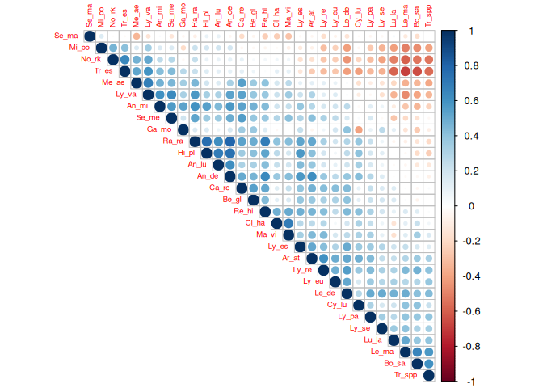
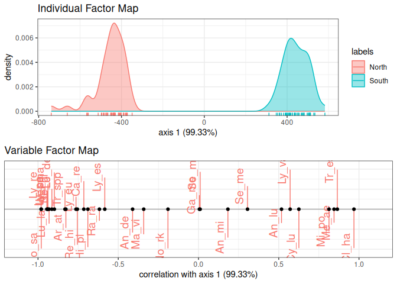
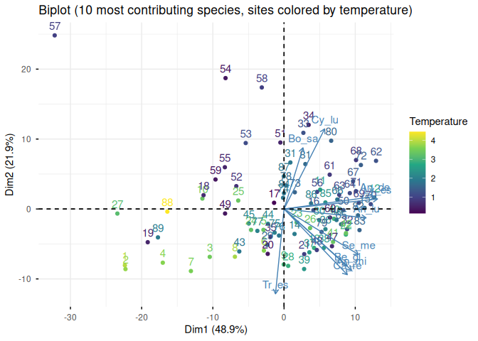
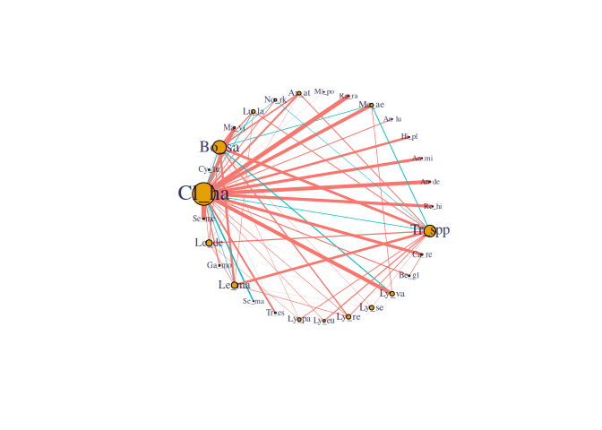
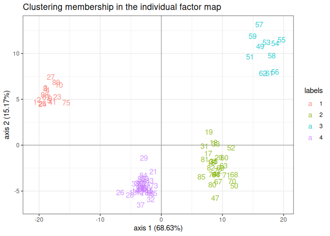

# PLNmodels: Poisson lognormal models for multivariate count data


<!-- badges: start -->

[](https://github.com/PLN-team/PLNmodels/actions/workflows/R-CMD-check.yaml)
[](https://codecov.io/github/pln-team/PLNmodels?branch=master)
[](https://cran.r-project.org/package=PLNmodels)
[](https://lifecycle.r-lib.org/articles/stages.html)
[](https://github.com/pln-team/PLNmodels/commits/master)
<!-- badges: end -->

## Description

> The Poisson lognormal model and variants[^1] can be used for a variety
> of multivariate problems when count data are at play. This package
> implements efficient variational algorithms to fit such models,
> accompanied with a set of functions for visualization and diagnostic.
> See [all the dedicated
> vignettes](https://pln-team.github.io/PLNmodels/articles/) for a
> comprehensive introduction.

**PLNmodels** covers the following models, all built around the
multivariate Poisson-lognormal distribution and sharing a common
formula-based interface (covariates, offsets, weights) and a choice of
optimization backends (a fast built-in Newton solver, NLOPT, and an
experimental torch backend):

- **PLN**[^2]: unpenalized multivariate Poisson regression, with several
  covariance structures (full, diagonal, spherical, fixed, or a
  genetic/heritability structure).
- **PLNPCA**[^3]: probabilistic Poisson PCA — a rank-constrained
  covariance for dimension reduction and visualization.
- **PLNLDA**: Poisson lognormal discriminant analysis[^4] for the
  supervised classification of count data.
- **PLNnetwork**[^5]: sparse inverse-covariance (network) inference via
  a graphical-lasso-like penalty[^6].
- **PLNmixture**: model-based clustering[^7] of count data via a mixture
  of PLN models.
- **ZIPLN**[^8]: a zero-inflated extension of PLN for data with excess
  zeros, with the same family of covariance structures and an optional
  sparse (`ZIPLNnetwork`[^9]) variant.

## Installation

**PLNmodels** is available on
[CRAN](https://cran.r-project.org/package=PLNmodels). The development
version is available on [GitHub](https://github.com/pln-team/PLNmodels).

``` r
install.packages("PLNmodels")             # last stable version, from CRAN
remotes::install_github("pln-team/PLNmodels")            # development version, from GitHub
remotes::install_github("pln-team/PLNmodels@tag_number")  # a specific tagged release
```

## Illustration

We illustrate the main models on the `barents` data set[^10]: the
abundance of 30 fish species observed in 89 sites in the Barents sea,
along with depth, temperature and geographic coordinates for each site.

``` r
library(PLNmodels)
```

    This is package 'PLNmodels' version 1.3.0-9010

``` r
data(barents)
## a simple North/South split of the sites, used below to illustrate PLNLDA
barents$zone <- factor(ifelse(barents$Latitude > median(barents$Latitude), "North", "South"))
```

### PLN: fit and inspect the covariance structure

``` r
myPLN <- PLN(Abundance ~ Depth + Temperature + offset(log(Offset)), data = barents)
```


     Initialization...
     Adjusting a full covariance PLN model with nlopt optimizer
     Post-treatments...
     DONE!

``` r
myPLN
```

    A multivariate Poisson Lognormal fit with full covariance model.
    ==================================================================
     nb_param    loglik       BIC       AIC      ICL
          555 -4412.201 -5657.797 -4967.201 -8203.81
    ==================================================================
    * Useful fields
        $model_par, $latent, $latent_pos, $var_par, $optim_par
        $loglik, $BIC, $ICL, $loglik_vec, $nb_param, $criteria
    * Useful S3 methods
        print(), coef(), sigma(), vcov(), fitted()
        predict(), predict_cond(), standard_error()

``` r
corrplot::corrplot(cov2cor(sigma(myPLN)), order = "AOE", type = "upper", tl.cex = 0.6)
```



### PLNLDA: discriminant analysis

``` r
myLDA <- PLNLDA(Abundance ~ offset(log(Offset)), grouping = zone, data = barents)
```


     Performing discriminant Analysis...
     DONE!

``` r
plot(myLDA)
```



### PLNPCA: dimension reduction

``` r
myPCAs <- PLNPCA(Abundance ~ Depth + Temperature + offset(log(Offset)), data = barents, ranks = 1:5)
```


     Initialization...

     Adjusting 5 PLN models for PCA analysis.
         Rank approximation = 1 
         Rank approximation = 2 
         Rank approximation = 3 
         Rank approximation = 4 
         Rank approximation = 5 
     Post-treatments
     DONE!

``` r
myPCA  <- getBestModel(myPCAs)
factoextra::fviz_pca_biplot(
  myPCA, select.var = list(contrib = 10), col.ind = barents$Temperature,
  title = "Biplot (10 most contributing species, sites colored by temperature)"
) + ggplot2::labs(col = "Temperature") + ggplot2::scale_color_viridis_c()
```



### PLNnetwork: sparse network inference

``` r
myNets <- PLNnetwork(Abundance ~ Depth + Temperature + offset(log(Offset)), data = barents)
```


     Initialization...
     Adjusting 30 PLN with sparse inverse covariance estimation
        Joint optimization alternating gradient descent and graphical-lasso
        sparsifying penalty = 3.77829 
        sparsifying penalty = 3.489896 
        sparsifying penalty = 3.223515 
        sparsifying penalty = 2.977467 
        sparsifying penalty = 2.7502 
        sparsifying penalty = 2.540279 
        sparsifying penalty = 2.346382 
        sparsifying penalty = 2.167285 
        sparsifying penalty = 2.001858 
        sparsifying penalty = 1.849058 
        sparsifying penalty = 1.707921 
        sparsifying penalty = 1.577557 
        sparsifying penalty = 1.457143 
        sparsifying penalty = 1.345921 
        sparsifying penalty = 1.243188 
        sparsifying penalty = 1.148296 
        sparsifying penalty = 1.060648 
        sparsifying penalty = 0.9796893 
        sparsifying penalty = 0.9049105 
        sparsifying penalty = 0.8358394 
        sparsifying penalty = 0.7720405 
        sparsifying penalty = 0.7131113 
        sparsifying penalty = 0.6586802 
        sparsifying penalty = 0.6084037 
        sparsifying penalty = 0.5619647 
        sparsifying penalty = 0.5190704 
        sparsifying penalty = 0.4794502 
        sparsifying penalty = 0.4428542 
        sparsifying penalty = 0.4090515 
        sparsifying penalty = 0.377829 
     Post-treatments
     DONE!

``` r
plot(getBestModel(myNets), remove.isolated = TRUE)
```



### PLNmixture: model-based clustering

``` r
my_mixtures <- PLNmixture(Abundance ~ offset(log(Offset)), data = barents, clusters = 1:4,
                           control = PLNmixture_param(smoothing = "none"))
```


     Initialization...

     Adjusting 4 PLN mixture models.
        number of cluster = 1 
        number of cluster = 2 
        number of cluster = 3 
        number of cluster = 4 
     Post-treatments
     DONE!

``` r
myMixture <- getBestModel(my_mixtures)
plot(myMixture, "pca", main = "Clustering membership in the individual factor map")
```



``` r
table(cluster = myMixture$memberships, zone = barents$zone)
```

           zone
    cluster North South
          1     1    17
          2    11     0
          3    11    22
          4    21     6

## References

[^1]: J. Chiquet, M. Mariadassou and S. Robin: The Poisson-lognormal
    model as a versatile framework for the joint analysis of species
    abundances, Frontiers in Ecology and Evolution, 2021.
    [doi:10.3389/fevo.2021.588292](https://www.frontiersin.org/articles/10.3389/fevo.2021.588292/full)

[^2]: Aitchison, J. and Ho, C. H. The multivariate Poisson-log normal
    distribution. Biometrika, 76(4), 1989, 643–653.

[^3]: J. Chiquet, M. Mariadassou and S. Robin: Variational inference for
    probabilistic Poisson PCA, the Annals of Applied Statistics, 12:
    2674–2698, 2018.
    [doi:10.1214/18-AOAS1177](http://dx.doi.org/10.1214/18%2DAOAS1177)

[^4]: Fisher, R. A. The use of multiple measurements in taxonomic
    problems. Annals of Eugenics, 7(2), 1936; Rao, C. R. The utilization
    of multiple measurements in problems of biological classification.
    JRSS B, 10(2), 1948.

[^5]: J. Chiquet, M. Mariadassou and S. Robin: Variational inference for
    sparse network reconstruction from count data, Proceedings of the
    36th International Conference on Machine Learning (ICML), 2019.
    [link](http://proceedings.mlr.press/v97/chiquet19a.html)

[^6]: Friedman, J., Hastie, T. and Tibshirani, R. Sparse inverse
    covariance estimation with the graphical lasso. Biostatistics, 9(3),
    2008.

[^7]: Fraley, C. and Raftery, A. E. MCLUST: Software for model-based
    cluster analysis. Journal of Classification, 16(2), 1999.

[^8]: Batardière, B., Chiquet, J., Gindraud, F. and Mariadassou, M.
    Zero-inflation in the multivariate Poisson lognormal family.
    Statistics and Computing, 35, 2025.
    [doi:10.1007/s11222-025-10729-0](https://doi.org/10.1007/s11222-025-10729-0)

[^9]: Tous, J., Chiquet, J., Deacon, A. E., Fontrodona-Eslava, A.,
    Fraser, D. F. and Magurran, A. E. A JSDM with zero-inflation to
    improve inference of association networks from count community data
    with structural zeros. bioRxiv preprint, 2025.
    [doi:10.1101/2025.07.24.666553](https://doi.org/10.1101/2025.07.24.666553)

[^10]: Fossheim, M., Nilssen, E. M. and Aschan, M. Fish assemblages in
    the Barents Sea. Marine Biology Research, 2(4), 2006.
    [doi:10.1080/17451000600815698](https://doi.org/10.1080/17451000600815698)
