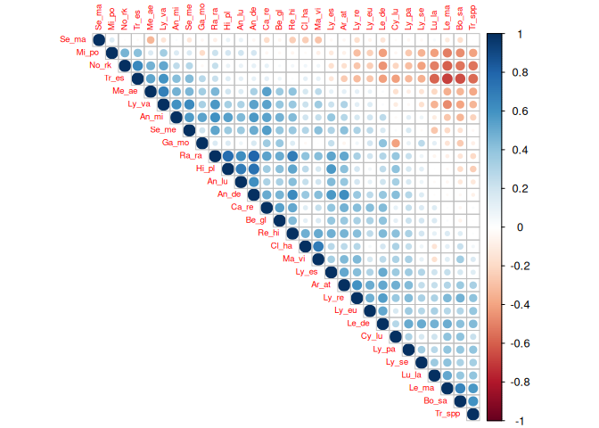
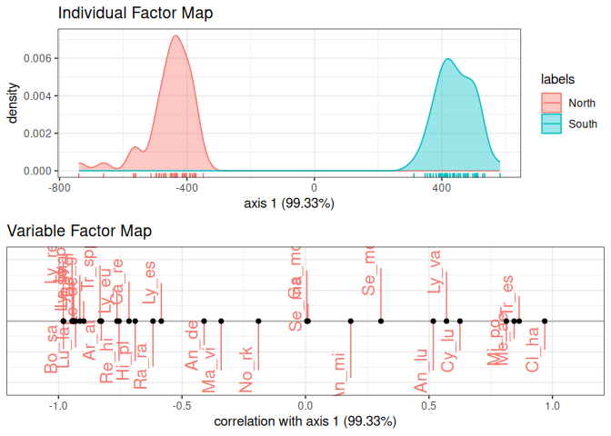
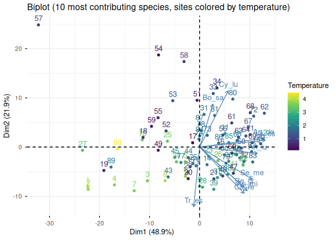
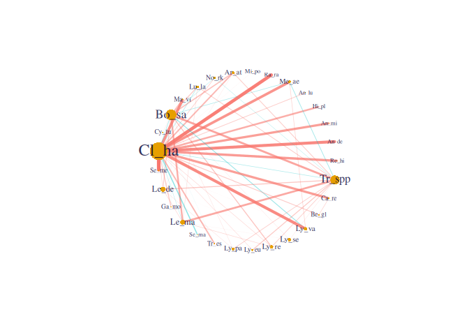
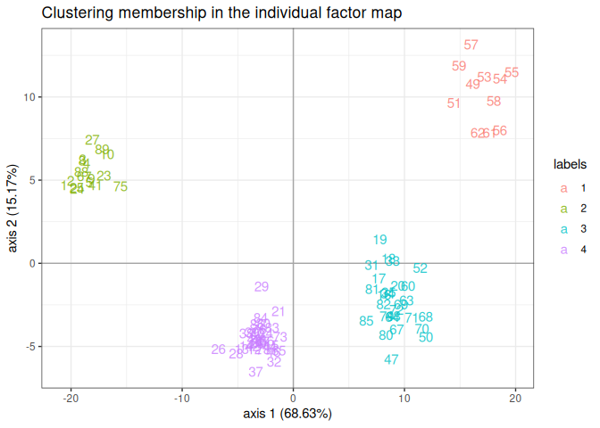

# PLNmodels: Poisson lognormal models for multivariate count data


<!-- badges: start -->

[](https://github.com/PLN-team/PLNmodels/actions/workflows/R-CMD-check.yaml)
[](https://codecov.io/github/pln-team/PLNmodels?branch=master)
[](https://cran.r-project.org/package=PLNmodels)
[](https://lifecycle.r-lib.org/articles/stages.html)
[](https://github.com/pln-team/PLNmodels/commits/master)

<!-- badges: end -->

## Description

> The Poisson lognormal model and variants ([Chiquet et al.
> 2021](#ref-chiquet2021)) can be used for a variety of multivariate
> problems when count data are at play. This package implements
> efficient variational algorithms to fit such models, accompanied with
> a set of functions for visualization and diagnostic. See [all the
> dedicated vignettes](https://pln-team.github.io/PLNmodels/articles/)
> for a comprehensive introduction.

**PLNmodels** covers the following models, all built around the
multivariate Poisson-lognormal distribution and sharing a common
formula-based interface (covariates, offsets, weights) and a choice of
optimization backends (a fast built-in Newton solver, NLOPT, and an
experimental torch backend):

- **PLN** ([Aitchison and Ho 1989](#ref-AiH89)): unpenalized
  multivariate Poisson regression, with several covariance structures
  (full, diagonal, spherical, fixed, or a genetic/heritability
  structure).
- **PLNPCA** ([Chiquet et al. 2018](#ref-PLNPCA)): probabilistic Poisson
  PCA — a rank-constrained covariance for dimension reduction and
  visualization.
- **PLNLDA**: Poisson lognormal discriminant analysis ([Fisher
  1936](#ref-fisher1936)) for the supervised classification of count
  data.
- **PLNnetwork** ([Chiquet et al. 2019](#ref-PLNnetwork)): sparse
  inverse-covariance (network) inference via a graphical-lasso-like
  penalty ([Friedman et al. 2008](#ref-FHT08)).
- **PLNmixture**: model-based clustering ([Fraley and Raftery
  1999](#ref-fraley1999)) of count data via a mixture of PLN models.
- **ZIPLN** ([Batardière et al. 2025](#ref-ZIPLN)): a zero-inflated
  extension of PLN for data with excess zeros, with the same family of
  covariance structures and an optional sparse (`ZIPLNnetwork`) variant
  ([Tous et al. 2025](#ref-ZIPLNnetwork)).

## Installation

**PLNmodels** is available on
[CRAN](https://cran.r-project.org/package=PLNmodels). The development
version is available on [GitHub](https://github.com/pln-team/PLNmodels).

``` r
install.packages("PLNmodels")             # last stable version, from CRAN
remotes::install_github("pln-team/PLNmodels")            # development version, from GitHub
remotes::install_github("pln-team/PLNmodels@tag_number")  # a specific tagged release
```

## Illustration

We illustrate the main models on the `barents` data set ([Fossheim et
al. 2006](#ref-fossheim2006)): the abundance of 30 fish species observed
in 89 sites in the Barents sea, along with depth, temperature and
geographic coordinates for each site.

``` r
library(PLNmodels)
```

    This is package 'PLNmodels' version 1.3.0-9010

``` r
data(barents)
## a simple North/South split of the sites, used below to illustrate PLNLDA
barents$zone <- factor(ifelse(barents$Latitude > median(barents$Latitude), "North", "South"))
```

### PLN: fit and inspect the covariance structure

``` r
myPLN <- PLN(Abundance ~ Depth + Temperature + offset(log(Offset)), data = barents)
```


     Initialization...
     Adjusting a full covariance PLN model with nlopt optimizer
     Post-treatments...
     DONE!

``` r
myPLN
```

    A multivariate Poisson Lognormal fit with full covariance model.
    ==================================================================
     nb_param    loglik       BIC       AIC       ICL
          555 -4412.385 -5657.981 -4967.385 -8194.015
    ==================================================================
    * Useful fields
        $model_par, $latent, $latent_pos, $var_par, $optim_par
        $loglik, $BIC, $ICL, $loglik_vec, $nb_param, $criteria
    * Useful S3 methods
        print(), coef(), sigma(), vcov(), fitted()
        predict(), predict_cond(), standard_error()

``` r
corrplot::corrplot(cov2cor(sigma(myPLN)), order = "AOE", type = "upper", tl.cex = 0.6)
```



### PLNLDA: discriminant analysis

``` r
myLDA <- PLNLDA(Abundance ~ offset(log(Offset)), grouping = zone, data = barents)
```


     Performing discriminant Analysis...
     DONE!

``` r
plot(myLDA)
```



### PLNPCA: dimension reduction

``` r
myPCAs <- PLNPCA(Abundance ~ Depth + Temperature + offset(log(Offset)), data = barents, ranks = 1:5)
```


     Initialization...

     Adjusting 5 PLN models for PCA analysis.
         Rank approximation = 1 
         Rank approximation = 2 
         Rank approximation = 3 
         Rank approximation = 4 
         Rank approximation = 5 
     Post-treatments
     DONE!

``` r
myPCA  <- getBestModel(myPCAs)
factoextra::fviz_pca_biplot(
  myPCA, select.var = list(contrib = 10), col.ind = barents$Temperature,
  title = "Biplot (10 most contributing species, sites colored by temperature)"
) + ggplot2::labs(col = "Temperature") + ggplot2::scale_color_viridis_c()
```



### PLNnetwork: sparse network inference

``` r
myNets <- PLNnetwork(Abundance ~ Depth + Temperature + offset(log(Offset)), data = barents)
```


     Initialization...
     Adjusting 30 PLN with sparse inverse covariance estimation
        Joint optimization alternating gradient descent and graphical-lasso
        sparsifying penalty = 3.77829 
        sparsifying penalty = 3.489896 
        sparsifying penalty = 3.223515 
        sparsifying penalty = 2.977467 
        sparsifying penalty = 2.7502 
        sparsifying penalty = 2.540279 
        sparsifying penalty = 2.346382 
        sparsifying penalty = 2.167285 
        sparsifying penalty = 2.001858 
        sparsifying penalty = 1.849058 
        sparsifying penalty = 1.707921 
        sparsifying penalty = 1.577557 
        sparsifying penalty = 1.457143 
        sparsifying penalty = 1.345921 
        sparsifying penalty = 1.243188 
        sparsifying penalty = 1.148296 
        sparsifying penalty = 1.060648 
        sparsifying penalty = 0.9796893 
        sparsifying penalty = 0.9049105 
        sparsifying penalty = 0.8358394 
        sparsifying penalty = 0.7720405 
        sparsifying penalty = 0.7131113 
        sparsifying penalty = 0.6586802 
        sparsifying penalty = 0.6084037 
        sparsifying penalty = 0.5619647 
        sparsifying penalty = 0.5190704 
        sparsifying penalty = 0.4794502 
        sparsifying penalty = 0.4428542 
        sparsifying penalty = 0.4090515 
        sparsifying penalty = 0.377829 
     Post-treatments
     DONE!

``` r
plot(getBestModel(myNets), remove.isolated = TRUE)
```



### PLNmixture: model-based clustering

``` r
my_mixtures <- PLNmixture(Abundance ~ offset(log(Offset)), data = barents, clusters = 1:4,
                           control = PLNmixture_param(smoothing = "none"))
```


     Initialization...

     Adjusting 4 PLN mixture models.
        number of cluster = 1 
        number of cluster = 2 
        number of cluster = 3 
        number of cluster = 4 
     Post-treatments
     DONE!

``` r
myMixture <- getBestModel(my_mixtures)
plot(myMixture, "pca", main = "Clustering membership in the individual factor map")
```



``` r
table(cluster = myMixture$memberships, zone = barents$zone)
```

           zone
    cluster North South
          1    11     0
          2    11    22
          3     1    17
          4    21     6

## References

<div id="refs" class="references csl-bib-body hanging-indent">

<div id="ref-AiH89" class="csl-entry">

Aitchison, J., and C. H. Ho. 1989. “The Multivariate Poisson-Log Normal
Distribution.” *Biometrika* 76 (4): 643–53.

</div>

<div id="ref-ZIPLN" class="csl-entry">

Batardière, Bastien, Julien Chiquet, François Gindraud, and Mahendra
Mariadassou. 2025. “Zero-Inflation in the Multivariate Poisson Lognormal
Family.” *Statistics and Computing* 35.
<https://doi.org/10.1007/s11222-025-10729-0>.

</div>

<div id="ref-PLNPCA" class="csl-entry">

Chiquet, Julien, Mahendra Mariadassou, and Stéphane Robin. 2018.
“Variational Inference for Probabilistic Poisson PCA.” *The Annals of
Applied Statistics* 12: 2674–98.

</div>

<div id="ref-chiquet2021" class="csl-entry">

Chiquet, Julien, Mahendra Mariadassou, and Stéphane Robin. 2021. “The
Poisson-Lognormal Model as a Versatile Framework for the Joint Analysis
of Species Abundances.” *Frontiers in Ecology and Evolution* 9 (March):
588292. <https://doi.org/10.3389/fevo.2021.588292>.

</div>

<div id="ref-PLNnetwork" class="csl-entry">

Chiquet, Julien, Stephane Robin, and Mahendra Mariadassou. 2019.
“Variational Inference for Sparse Network Reconstruction from Count
Data.” In *Proceedings of the 36th International Conference on Machine
Learning*, edited by Kamalika Chaudhuri and Ruslan Salakhutdinov, vol.
97. Proceedings of Machine Learning Research. PMLR.
<http://proceedings.mlr.press/v97/chiquet19a.html>.

</div>

<div id="ref-fisher1936" class="csl-entry">

Fisher, R. A. 1936. “The Use of Multiple Measurements in Taxonomic
Problems.” *Annals of Eugenics* 7 (2): 179–88.
<https://doi.org/10.1111/j.1469-1809.1936.tb02137.x>.

</div>

<div id="ref-fossheim2006" class="csl-entry">

Fossheim, Maria, Einar M. Nilssen, and Michaela Aschan. 2006. “Fish
Assemblages in the Barents Sea.” *Marine Biology Research* 2 (4):
260–69. <https://doi.org/10.1080/17451000600815698>.

</div>

<div id="ref-fraley1999" class="csl-entry">

Fraley, Chris, and Adrian E. Raftery. 1999. “MCLUST: Software for
Model-Based Cluster Analysis.” *Journal of Classification* 16 (2):
297–306. <https://doi.org/10.1007/s003579900058>.

</div>

<div id="ref-FHT08" class="csl-entry">

Friedman, J., T. Hastie, and R. Tibshirani. 2008. “Sparse Inverse
Covariance Estimation with the Graphical Lasso.” *Biostatistics* 9 (3):
432–41.

</div>

<div id="ref-ZIPLNnetwork" class="csl-entry">

Tous, Jeanne, Julien Chiquet, Amy E. Deacon, Ada Fontrodona-Eslava,
Douglas F. Fraser, and Anne E. Magurran. 2025. “A JSDM with
Zero-Inflation to Improve Inference of Association Networks from Count
Community Data with Structural Zeros.”
<https://doi.org/10.1101/2025.07.24.666553>.

</div>

</div>
