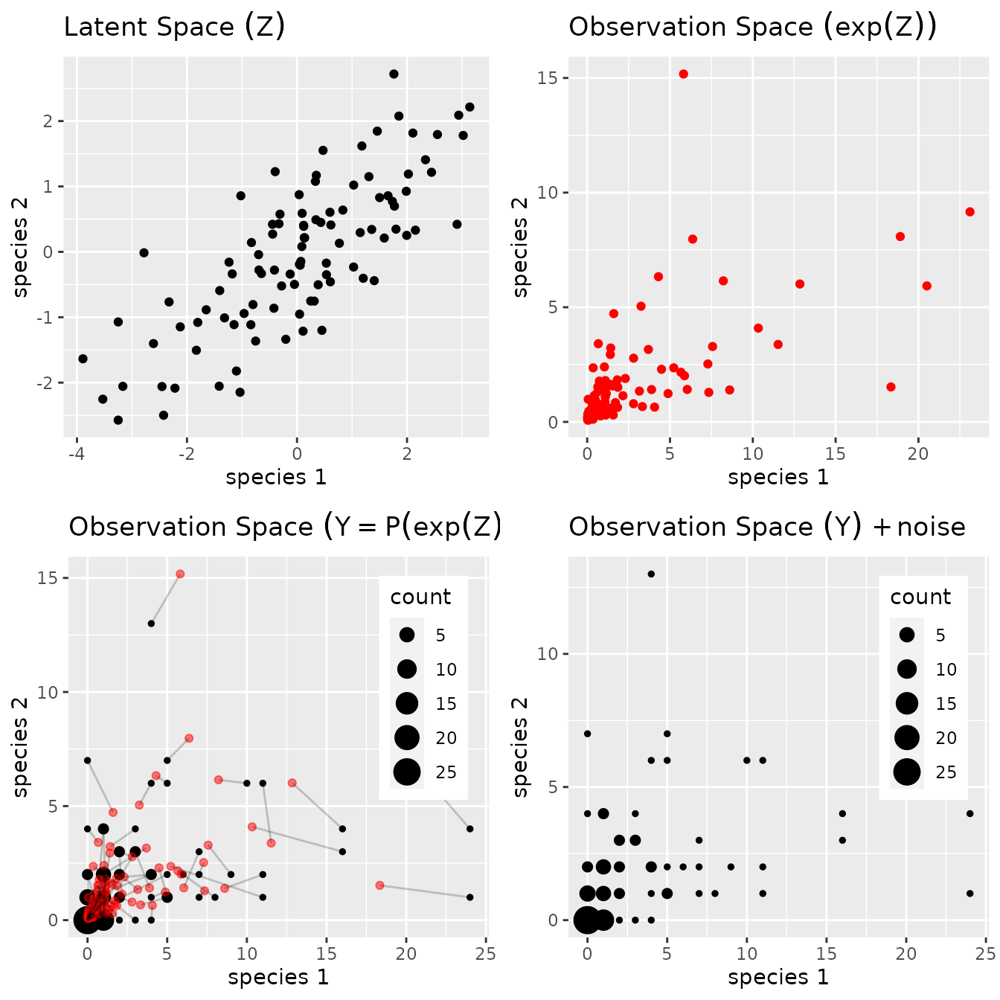
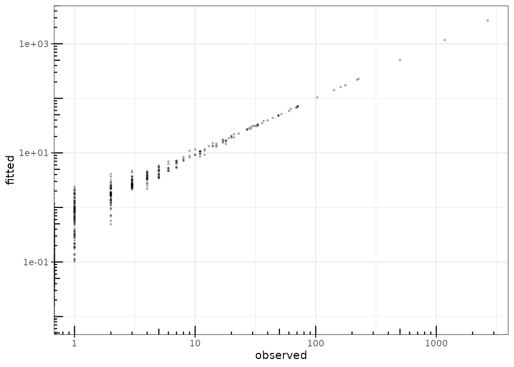
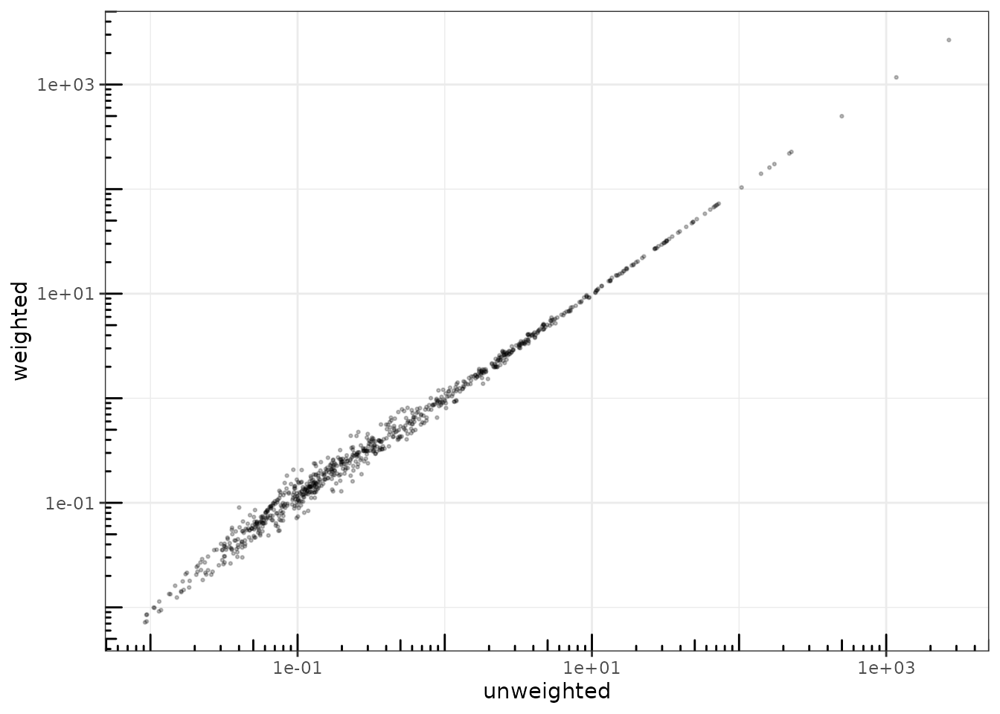

# Analyzing multivariate count data with the Poisson log-normal model

## Preliminaries

This vignette illustrates the use of the `PLN` function and the methods
accompanying the R6 class `PLNfit`.

From the statistical point of view, the function `PLN` adjusts a
multivariate Poisson lognormal model to a table of counts, possibly
after correcting for effects of offsets and covariates. `PLN` is the
building block for all the multivariate models found in the `PLNmodels`
package: having a basic understanding of both the mathematical
background and the associated set of `R` functions is a good place to
start.

### Requirements

The packages required for the analysis are **PLNmodels** plus some
others for data manipulation and representation:

``` r

library(PLNmodels)
library(ggplot2)
library(corrplot)
```

### Data set

We illustrate our point with the trichoptera data set, a full
description of which can be found in [the corresponding
vignette](https://pln-team.github.io/PLNmodels/articles/Trichoptera.md).
Data preparation is also detailed in [the specific
vignette](https://pln-team.github.io/PLNmodels/articles/Import_data.md).

``` r

data(trichoptera)
trichoptera <- prepare_data(trichoptera$Abundance, trichoptera$Covariate)
```

The `trichoptera` data frame stores a matrix of counts
(`trichoptera$Abundance`), a matrix of offsets (`trichoptera$Offset`)
and some vectors of covariates (`trichoptera$Wind`,
`trichoptera$Temperature`, etc.)

### Mathematical background

The multivariate Poisson lognormal model (in short PLN, see Aitchison
and Ho ([1989](#ref-AiH89))) relates some $`p`$-dimensional observation
vectors $`\mathbf{Y}_i`$ to some $`p`$-dimensional vectors of Gaussian
latent variables $`\mathbf{Z}_i`$ as follows

``` math
\begin{equation}
  \begin{array}{rcl}
  \text{latent space } &   \mathbf{Z}_i \sim \mathcal{N}({\boldsymbol\mu},\boldsymbol\Sigma), \\
  \text{observation space } &  Y_{ij} | Z_{ij} \quad \text{indep.} &   \mathbf{Y}_i | \mathbf{Z}_i\sim\mathcal{P}\left(\exp\{\mathbf{Z}_i\}\right).
  \end{array}
\end{equation}
```

The parameter $`{\boldsymbol\mu}`$ corresponds to the main effects and
the latent covariance matrix $`\boldsymbol\Sigma`$ describes the
underlying residual structure of dependence between the $`p`$ variables.
The following figure provides insights about the role played by the
different layers



PLN: geometrical view

#### Covariates and offsets

This model generalizes naturally to a formulation closer to a
multivariate generalized linear model, where the main effect is due to a
linear combination of $`d`$ covariates $`\mathbf{x}_i`$ (including a
vector of intercepts). We also let the possibility to add some offsets
for the $`p`$ variables in in each sample, that is $`\mathbf{o}_i`$.
Hence, the previous model generalizes to

\$\$\begin{equation} \mathbf{Y}\_i \| \mathbf{Z}\_i \sim
\mathcal{P}\left(\exp\\\mathbf{Z}\_i\\\right), \qquad \mathbf{Z}\_i \sim
\mathcal{N}({\mathbf{o}\_i +
\mathbf{x}\_i^\top\mathbf{B}},\boldsymbol\Sigma), \\ \end{equation}\$\$
where $`\mathbf{B}`$ is a $`d\times p`$ matrix of regression parameters.
When all individuals $`i=1,\dots,n`$ are stacked together, the data
matrices available to feed the model are

- the $`n\times p`$ matrix of counts $`\mathbf{Y}`$
- the $`n\times d`$ matrix of design $`\mathbf{X}`$
- the $`n\times p`$ matrix of offsets $`\mathbf{O}`$

Inference in PLN then focuses on the regression parameters
$`\mathbf{B}`$ and on the covariance matrix $`\boldsymbol\Sigma`$.

#### Optimization by Variational inference

Technically speaking, we adopt in **PLNmodels** a variational strategy
to approximate the log-likelihood function and optimize the consecutive
variational surrogate of the log-likelihood with a gradient-ascent-based
approach. To this end, we rely on the CCSA algorithm of Svanberg
([2002](#ref-Svan02)) implemented in the C++ library ([Johnson
2011](#ref-nlopt)), which we link to the package.

## Analysis of trichoptera data with a PLN model

The standard PLN model described above is adjusted with the function
`PLN`. We now review its usage on a the trichoptera data set.

### A PLN model with latent main effects

#### Adjusting a fit

In order to become familiar with the function `PLN` and its outputs, let
us first fit a simple PLN model with just an intercept for each species:

``` r

myPLN <- PLN(Abundance ~ 1, trichoptera)
```

    ## 
    ##  Initialization...
    ##  Adjusting a full covariance PLN model with nlopt optimizer
    ##  Post-treatments...
    ##  DONE!

Note the use of the `formula` object to specify the model: the vector
$`\boldsymbol\mu`$ of main effects in the mathematical formulation (one
per column species) is specified in the call with the term `~ 1` in the
right-hand-side of the formula. `Abundance` is a variable in the data
frame `trichoptera` corresponding to a matrix of 17 columns and the
*response* in the model, occurring on the left-hand-side of the formula.

#### The `PLNfit` object

`myPLN` is an `R6` object with class `PLNfit`, which comes with a couple
of methods, as recalled when printing/showing such an object in the `R`
console:

``` r

myPLN
```

    ## A multivariate Poisson Lognormal fit with full covariance model.
    ## ==================================================================
    ##  nb_param    loglik       BIC       AIC       ICL
    ##       170 -1129.624 -1460.429 -1299.624 -2270.936
    ## ==================================================================
    ## * Useful fields
    ##     $model_par, $latent, $latent_pos, $var_par, $optim_par
    ##     $loglik, $BIC, $ICL, $loglik_vec, $nb_param, $criteria
    ## * Useful S3 methods
    ##     print(), coef(), sigma(), vcov(), fitted()
    ##     predict(), predict_cond(), standard_error()

See also
[`?PLNfit`](https://pln-team.github.io/PLNmodels/reference/PLNfit.md)
for more comprehensive information.

#### Field access

Accessing public fields of a `PLNfit` object can be done just like with
a traditional list, *e.g.*,

``` r

c(myPLN$loglik, myPLN$BIC, myPLN$ICL)
```

    ## [1] -1129.624 -1460.429 -2270.936

``` r

myPLN$criteria
```

    ##   nb_param    loglik       BIC       AIC       ICL
    ## 1      170 -1129.624 -1460.429 -1299.624 -2270.936

#### GLM-like interface

We provide a set of S3-methods for `PLNfit` that mimic the standard
(G)LM-like interface of `R::stats`, which we present now.

One can access the fitted value of the counts (`Abundance` –
$`\hat{\mathbf{Y}}`$) and check that the algorithm basically learned
correctly from the data[^1]:

``` r

data.frame(
  fitted   = as.vector(fitted(myPLN)),
  observed = as.vector(trichoptera$Abundance)
) %>% 
  ggplot(aes(x = observed, y = fitted)) + 
    geom_point(size = .5, alpha =.25 ) + 
    scale_x_log10() + 
    scale_y_log10() + 
    theme_bw() + annotation_logticks()
```



fitted value vs. observation

The residual correlation matrix better displays as an image matrix:

``` r

myPLN %>% sigma() %>% cov2cor() %>% corrplot()
```


#### Observation weights

It is also possible to use observation weights like in standard (G)LMs:

``` r

myPLN_weighted <-
  PLN(
    Abundance ~ 1,
    data    = trichoptera,
    weights = runif(nrow(trichoptera)),
    control = PLN_param(trace = 0)
  )
data.frame(
  unweighted = as.vector(fitted(myPLN)),
  weighted   = as.vector(fitted(myPLN_weighted))
) %>%
  ggplot(aes(x = unweighted, y = weighted)) +
    geom_point(size = .5, alpha =.25 ) +
    scale_x_log10() +
    scale_y_log10() +
    theme_bw() + annotation_logticks()
```



### Accounting for covariates and offsets

For ecological count data, it is generally a good advice to include the
sampling effort via an offset term whenever available, otherwise samples
are not necessarily comparable:

``` r

myPLN_offsets <- 
  PLN(Abundance ~ 1 + offset(log(Offset)), 
      data = trichoptera, control = PLN_param(trace = 0))
```

Note that we use the function `offset` with a log-transform of the total
counts[^2] since it acts in the latent layer of the model. Obviously the
model with offsets is better since the log-likelihood is higher with the
same number of parameters[^3]:

``` r

rbind(
  myPLN$criteria,
  myPLN_offsets$criteria
) %>% knitr::kable()
```

| nb_param |    loglik |       BIC |       AIC |       ICL |
|---------:|----------:|----------:|----------:|----------:|
|      170 | -1129.624 | -1460.429 | -1299.624 | -2270.936 |
|      170 | -1051.721 | -1382.526 | -1221.721 | -2209.459 |

Let us try to correct for the wind effect in our model:

``` r

myPLN_wind <- PLN(Abundance ~ 1 + Wind + offset(log(Offset)), data = trichoptera)
```

    ## 
    ##  Initialization...
    ##  Adjusting a full covariance PLN model with nlopt optimizer
    ##  Post-treatments...
    ##  DONE!

When we compare the models, the gain is clear in terms of
log-likelihood. However, the BIC chooses not to include this variable:

``` r

rbind(
  myPLN_offsets$criteria,
  myPLN_wind$criteria
) %>% knitr::kable()
```

| nb_param |    loglik |       BIC |       AIC |       ICL |
|---------:|----------:|----------:|----------:|----------:|
|      170 | -1051.721 | -1382.526 | -1221.721 | -2209.459 |
|      187 | -1027.974 | -1391.859 | -1214.974 | -2071.767 |

### Covariance models (full, diagonal, spherical)

It is possible to change a bit the parametrization used for modeling the
residual covariance matrix $`\boldsymbol\Sigma`$, and thus reduce the
total number of parameters used in the model. By default, the residual
covariance is fully parameterized (hence $`p \times (p+1)/2`$
parameters). However, we can chose to only model the variances of the
species and not the covariances, by means of a diagonal matrix
$`\boldsymbol\Sigma_D`$ with only $`p`$ parameters. In an extreme
situation, we may also chose a single variance parameter for the whole
matrix $`\boldsymbol\Sigma = \sigma \mathbf{I}_p`$. This can be tuned in
`PLN` with the `control` argument, a list controlling various aspects of
the underlying optimization process:

``` r

myPLN_spherical <-
  PLN(
    Abundance ~ 1 + offset(log(Offset)),
    data = trichoptera, control = PLN_param(covariance = "spherical", trace = 0)
  )
```

``` r

myPLN_diagonal <-
  PLN(
    Abundance ~ 1 + offset(log(Offset)),
    data = trichoptera, control = PLN_param(covariance = "diagonal", trace = 0)
  )
```

Note that, by default, the model chosen is `covariance = "spherical"`,
so that the two following calls are equivalents:

``` r

myPLN_default <-
  PLN(Abundance ~ 1, data = trichoptera, )
```

    ## 
    ##  Initialization...
    ##  Adjusting a full covariance PLN model with nlopt optimizer
    ##  Post-treatments...
    ##  DONE!

``` r

myPLN_full <-
  PLN(Abundance ~ 1, data = trichoptera, control = PLN_param(covariance = "full"))
```

    ## 
    ##  Initialization...
    ##  Adjusting a full covariance PLN model with nlopt optimizer
    ##  Post-treatments...
    ##  DONE!

Different covariance models can then be compared with the usual
criteria: it seems that the gain brought by passing from a diagonal
matrix to a fully parameterized covariance is not worth having so many
additional parameters:

``` r

rbind(
  myPLN_offsets$criteria,
  myPLN_diagonal$criteria,
  myPLN_spherical$criteria
) %>%
  as.data.frame(row.names = c("full", "diagonal", "spherical")) %>%
  knitr::kable()
```

|           | nb_param |    loglik |       BIC |       AIC |       ICL |
|:----------|---------:|----------:|----------:|----------:|----------:|
| full      |      170 | -1051.721 | -1382.526 | -1221.721 | -2209.459 |
| diagonal  |       34 | -1109.653 | -1175.814 | -1143.653 | -2068.655 |
| spherical |       18 | -1158.440 | -1193.467 | -1176.440 | -2153.219 |

A final model that we can try is the diagonal one with the wind as a
covariate, which gives a slight improvement.

``` r

myPLN_final <-
  PLN(
    Abundance ~ 1 + Wind + offset(log(Offset)),
    data    = trichoptera, control = PLN_param(covariance = "diagonal", trace = 0)
  )
rbind(
  myPLN_wind$criteria,
  myPLN_diagonal$criteria,
  myPLN_final$criteria
) %>% knitr::kable()
```

| nb_param |    loglik |       BIC |       AIC |       ICL |
|---------:|----------:|----------:|----------:|----------:|
|      187 | -1027.974 | -1391.859 | -1214.974 | -2071.767 |
|       34 | -1109.653 | -1175.814 | -1143.653 | -2068.655 |
|       51 | -1073.028 | -1172.269 | -1124.028 | -1777.223 |

## References

Aitchison, J., and C. H. Ho. 1989. “The Multivariate Poisson-Log Normal
Distribution.” *Biometrika* 76 (4): 643–53.

Johnson, Steven G. 2011. *The NLopt Nonlinear-Optimization Package*.
<https://nlopt.readthedocs.io/en/latest/>.

Svanberg, Krister. 2002. “A Class of Globally Convergent Optimization
Methods Based on Conservative Convex Separable Approximations.” *SIAM
Journal on Optimization* 12 (2): 555–73.

[^1]: We use a log-log scale in our plot in order not to give an
    excessive importance to the higher counts in the fit

[^2]: Note that if the offset is not computed on the same scale as the
    count, you might need a different transformation than the log. To
    ensure that the offset are on the count-scale, you can use the
    `scale = "count"` argument in
    [`prepare_data()`](https://pln-team.github.io/PLNmodels/reference/prepare_data.md),
    see also the [corresponding
    vignette](https://pln-team.github.io/PLNmodels/articles/Import_data.md).

[^3]: In **PLNmodels** the R-squared is a pseudo-R-squared that can only
    be trusted between model where the same offsets term was used
