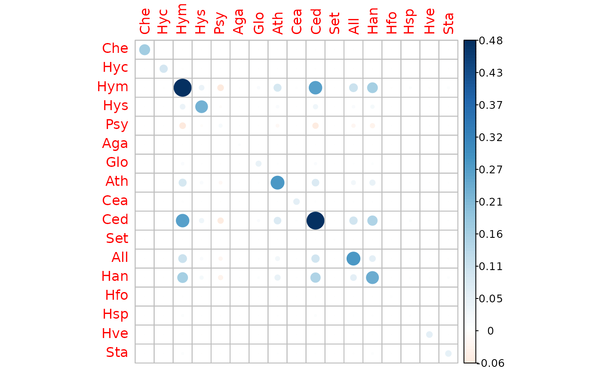
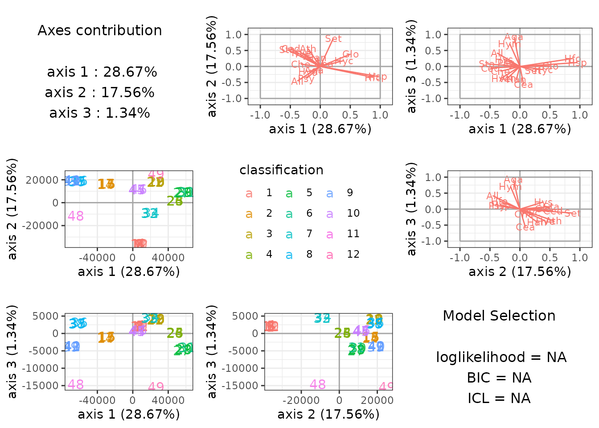
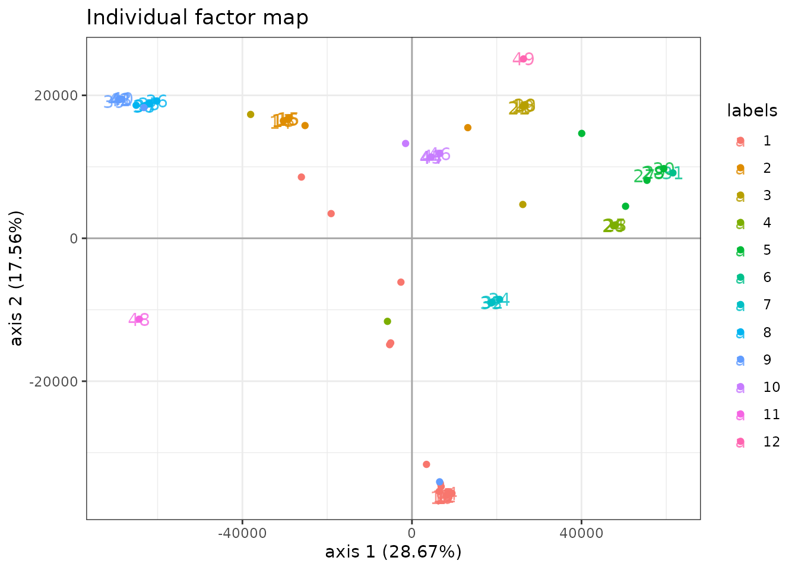
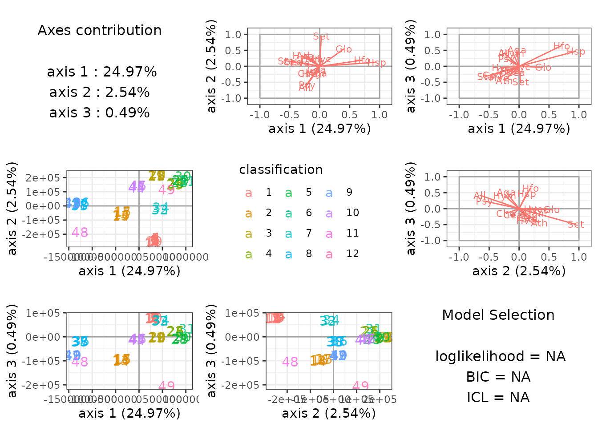

# Supervized classification of multivariate count table with the Poisson discriminant Analysis

## Preliminaries

This vignette illustrates the standard use of the `PLNLDA` function and
the methods accompanying the R6 Classes `PLNLDA` and `PLNLDAfit`.

### Requirements

The packages required for the analysis are **PLNmodels** plus some
others for data manipulation and representation:

``` r

library(PLNmodels)
```

### Data set

We illustrate our point with the trichoptera data set, a full
description of which can be found in [the corresponding
vignette](https://pln-team.github.io/PLNmodels/articles/Trichoptera.md).
Data preparation is also detailed in [the specific
vignette](https://pln-team.github.io/PLNmodels/articles/Import_data.md).

``` r

data(trichoptera)
trichoptera <- prepare_data(trichoptera$Abundance, trichoptera$Covariate)
```

The `trichoptera` data frame stores a matrix of counts
(`trichoptera$Abundance`), a matrix of offsets (`trichoptera$Offset`)
and some vectors of covariates (`trichoptera$Wind`,
`trichoptera$Temperature`, etc.) In the following, we’re particularly
interested in the `trichoptera$Group` **discrete** covariate which
corresponds to disjoint time spans during which the catching took place.
The correspondence between group label and time spans is:

| Label | Number.of.Consecutive.Nights |  Date   |
|:-----:|:----------------------------:|:-------:|
|   1   |              12              | June 59 |
|   2   |              5               | June 59 |
|   3   |              5               | June 59 |
|   4   |              4               | June 59 |
|   5   |              4               | July 59 |
|   6   |              1               | June 59 |
|   7   |              3               | June 60 |
|   8   |              4               | June 60 |
|   9   |              5               | June 60 |
|  10   |              4               | June 60 |
|  11   |              1               | June 60 |
|  12   |              1               | July 60 |

### Mathematical background

In the vein of Fisher ([1936](#ref-Fi36)) and Rao ([1948](#ref-Rao48)),
we introduce a multi-class LDA model for multivariate count data which
is a variant of the Poisson Lognormal model of Aitchison and Ho
([1989](#ref-AiH89)) (see [the PLN
vignette](https://pln-team.github.io/PLNmodels/articles/PLN.md) as a
reminder). Indeed, it can viewed as a PLN model with a discrete group
structure in the latent Gaussian space.

This PLN-LDA model can be written in a hierarchical framework where a
sample of $`p`$-dimensional observation vectors $`\mathbf{Y}_i`$ is
related to some $`p`$-dimensional vectors of latent variables
$`\mathbf{Z}_i`$ and a discrete structure with $`K`$ groups in the
following way:
``` math
\begin{equation} 
  \begin{array}{rcl}
    \text{group structure }   & \mathbf{\mu}_i = \mu_{g_i} & g_i \in \{1, \dots, K\}  \\
    \text{latent space }   & \mathbf{Z}_i \quad \text{indep.} & \mathbf{Z}_i \sim \mathcal{N}({\boldsymbol\mu}_i, \boldsymbol{\Sigma})  & \\
    \text{observation space } & Y_{ij} | Z_{ij} \quad \text{indep.} & Y_{ij} | Z_{ij} \sim \mathcal{P}\left(\exp\{Z_{ij}\}\right)
  \end{array}
\end{equation}
```
where $`g_i`$ denotes the group sample $`i`$ belongs to.

The different parameters $`{\boldsymbol\mu}_k \in\mathbb{R}^p`$
corresponds to the group-specific main effects and the variance matrix
$`\boldsymbol{\Sigma}`$ is shared among groups. An equivalent way of
writing this model is the following:
``` math
\begin{equation} 
  \begin{array}{rcl}
  \text{latent space } &   \mathbf{Z}_i \sim \mathcal{N}({\boldsymbol\mu}_i,\boldsymbol\Sigma) & \boldsymbol{\mu}_i = \mathbf{g}_i^\top \mathbf{M} \\
  \text{observation space } &  Y_{ij} | Z_{ij} \quad \text{indep.} & Y_{ij} | Z_{ij} \sim \mathcal{P}\left(\exp\{Z_{ij}\}\right),
  \end{array}
\end{equation}
```
where, with a slight abuse of notation, $`\mathbf{g}_i`$ is a
group-indicator vector of length $`K`$
($`g_{ik} = 1 \Leftrightarrow g_i = k`$) and
$`\mathbf{M} = [\boldsymbol{\mu}_1^\top, \dots, \boldsymbol{\mu}_K^\top]^\top`$
is a $`K \times p`$ matrix collecting the group-specific main effects.

#### Covariates and offsets

Just like PLN, PLN-LDA generalizes to a formulation close to a
multivariate generalized linear model where the main effect is due to a
linear combination of the discrete group structure, $`d`$ covariates
$`\mathbf{x}_i`$ and a vector $`\mathbf{o}_i`$ of $`p`$ offsets in
sample $`i`$. The latent layer then reads
``` math
\begin{equation} 
  \mathbf{Z}_i \sim \mathcal{N}({\mathbf{o}_i + \mathbf{g}_i^\top \mathbf{M} + \mathbf{x}_i^\top\mathbf{B}},\boldsymbol\Sigma)
\end{equation}
```
where $`\mathbf{B}`$ is a $`d\times p`$ matrix of regression parameters.

#### Prediction

Given:

- a new observation $`\mathbf{Y}`$ with associated offset $`\mathbf{o}`$
  and covariates $`\mathbf{x}`$
- a model with estimated parameters $`\hat{\boldsymbol{\Sigma}}`$,
  $`\hat{\mathbf{B}}`$, $`\hat{\mathbf{M}}`$ and group counts
  $`(n_1, \dots, n_K)`$

We can predict the observation’s group using Bayes rule as follows: for
$`k \in {1, \dots, K}`$, compute
``` math
\begin{equation}
\begin{aligned}
f_k(\mathbf{Y}) & = p(\mathbf{Y} | \mathbf{g} = k, \mathbf{o}, \mathbf{x}, \hat{\mathbf{B}}, \hat{\boldsymbol{\Sigma}}) \\
                & = \boldsymbol{\Phi}_{PLN}(\mathbf{Y}; \mathbf{o} + \boldsymbol{\mu}_k + \mathbf{x}^\top \hat{\mathbf{B}}, \hat{\boldsymbol{\Sigma}}) \\
p_k             & = \frac{n_k}{\sum_{k' = 1}^K n_{k'}}    
\end{aligned}
\end{equation}
```
where
$`\boldsymbol{\Phi}_{PLN}(\bullet; \boldsymbol{\mu}, \boldsymbol{\Sigma})`$
is the density function of a PLN distribution with parameters
$`(\boldsymbol{\mu}, \boldsymbol{\Sigma})`$. $`f_k(\mathbf{Y})`$ and
$`p_k`$ are respectively plug-in estimates of (i) the probability of
observing counts $`\mathbf{Y}`$ in a sample from group $`k`$ and (ii)
the probability that a sample originates from group $`k`$.

The posterior probability $`\hat{\pi}_k(\mathbf{Y})`$ that observation
$`\mathbf{Y}`$ belongs to group $`k`$ and most likely group
$`\hat{k}(\mathbf{Y})`$ can thus be defined as
``` math
\begin{equation}
\begin{aligned}
\hat{\pi}_k(\mathbf{Y}) & = \frac{p_k f_k(\mathbf{Y})}{\sum_{k' = 1}^K p_{k'} f_{k'}(\mathbf{Y})} \\
\hat{k}(\mathbf{Y})     & = \underset{k \in \{1, \dots, K\}}{\arg\max} \hat{\pi}_k(\mathbf{Y})
\end{aligned}
\end{equation}
```

#### Optimization by Variational inference

Classification and prediction are the main objectives in (PLN-)LDA. To
reach this goal, we first need to estimate the model parameters.
Inference in PLN-LDA focuses on the group-specific main effects
$`\mathbf{M}`$, the regression parameters $`\mathbf{B}`$ and the
covariance matrix $`\boldsymbol\Sigma`$. Technically speaking, we can
treat $`\mathbf{g}_i`$ as a discrete covariate and estimate
$`[\mathbf{M}, \mathbf{B}]`$ using the same strategy as for the standard
**PLN** model. Briefly, we adopt a variational strategy to approximate
the log-likelihood function and optimize the consecutive variational
surrogate of the log-likelihood with a gradient-ascent-based approach.
To this end, we rely on the CCSA algorithm of Svanberg
([2002](#ref-Svan02)) implemented in the C++ library ([Johnson
2011](#ref-nlopt)), which we link to the package.

## Analysis of trichoptera data with a PLN-LDA model

In the package, the PLN-LDA model is adjusted with the function
`PLNLDA`, which we review in this section. This function adjusts the
model and stores it in a object of class `PLNLDAfit` which inherits from
the class `PLNfit`, so we strongly recommend the reader to be somehow
comfortable with `PLN` and `PLNfit` before using `PLNLDA` (see [the PLN
vignette](https://pln-team.github.io/PLNmodels/articles/PLN.md)).

### A model with main effects and no covariates

We start by adjusting the above model to the Trichoptera data set. We
use `Group`, the catching time spans, as a discrete structure and use
log as an offset to capture differences in sampling luck.

The model can be fitted with the function `PLNLDA` as follows:

``` r

myLDA_nocov <- PLNLDA(Abundance ~ 0 + offset(log(Offset)),
                      grouping = Group, 
                      data = trichoptera)
```

    ## 
    ##  Performing discriminant Analysis...
    ##  DONE!

Note that `PLNLDA` uses the standard `formula` interface, like every
other model in the **PLNmodels** package.

#### Structure of `PLNLDAfit`

The `myLDA_nocov` variable is an `R6` object with class `PLNLDAfit`,
which comes with a couple of methods. The most basic is the `show/print`
method, which sends a brief summary of the estimation process and
available methods:

``` r

myLDA_nocov
```

    ## Linear Discriminant Analysis for Poisson Lognormal distribution
    ## ==================================================================
    ##  nb_param   loglik       BIC       AIC      ICL
    ##       357 -801.166 -1495.856 -1158.166 -1368.29
    ## ==================================================================
    ## * Useful fields
    ##     $model_par, $latent, $latent_pos, $var_par, $optim_par
    ##     $loglik, $BIC, $ICL, $loglik_vec, $nb_param, $criteria
    ## * Useful S3 methods
    ##     print(), coef(), sigma(), vcov(), fitted()
    ##     predict(), predict_cond(), standard_error()
    ## * Additional fields for LDA
    ##     $percent_var, $corr_map, $scores, $group_means
    ## * Additional S3 methods for LDA
    ##     plot.PLNLDAfit(), predict.PLNLDAfit()

Comprehensive information about `PLNLDAfit` is available via
[`?PLNLDAfit`](https://pln-team.github.io/PLNmodels/reference/PLNLDAfit.md).

#### Specific fields

The user can easily access several fields of the `PLNLDAfit` object
using `S3` methods, the most interesting ones are

- the $`p \times p`$ covariance matrix $`\hat{\boldsymbol{\Sigma}}`$:

``` r

sigma(myLDA_nocov) %>% corrplot::corrplot(is.corr = FALSE)
```



- the regression coefficient matrix $`\hat{\mathbf{B}}`$ (in this case
  `NULL` as there are no covariates)

``` r

coef(myLDA_nocov)
```

    ## NULL

- the $`p \times K`$ matrix of group means $`\mathbf{M}`$

``` r

myLDA_nocov$group_means %>% head() %>% knitr::kable(digits = 2)
```

| grouping1 | grouping2 | grouping3 | grouping4 | grouping5 | grouping6 | grouping7 | grouping8 | grouping9 | grouping10 | grouping11 | grouping12 |
|---:|---:|---:|---:|---:|---:|---:|---:|---:|---:|---:|---:|
| -10.54 | -6.83 | -11.24 | -10.33 | -12.64 | -15.21 | -12.34 | -11.27 | -11.09 | -5.71 | -3.51 | -11.66 |
| -10.42 | -11.98 | -5.71 | -10.21 | -7.48 | -15.09 | -12.23 | -11.14 | -10.98 | -11.23 | -10.53 | -4.50 |
| -2.38 | -3.96 | -2.36 | -2.92 | -6.49 | -5.55 | -2.69 | -2.03 | -2.70 | -2.65 | -10.18 | -3.85 |
| -10.53 | -12.11 | -5.71 | -4.55 | -12.56 | -15.23 | -12.35 | -5.54 | -5.62 | -4.92 | -10.67 | -11.69 |
| -0.28 | -0.26 | -0.62 | -1.09 | -0.61 | -0.11 | -0.66 | -0.80 | -0.39 | -0.45 | -0.60 | -1.16 |
| -4.01 | -3.32 | -2.94 | -4.48 | -6.75 | -8.00 | -2.85 | -3.06 | -5.55 | -3.99 | -10.28 | -11.30 |

The `PLNLDAfit` class also benefits from two important methods: `plot`
and `predict`.

#### `plot` method

The `plot` methods provides easy to interpret graphics which reveals
here that the groups are well separated:

``` r

plot(myLDA_nocov)
```



By default, `plot` shows the first 3 axis of the LDA when there are 4 or
more groups and uses special representations for the edge cases of 3 or
less groups.

`ggplot2`-savvy users who want to make their own representations can
extracts the $`n \times (K-1)`$ matrix of sample scores from the
`PLNLDAfit` object …

``` r

myLDA_nocov$scores %>% head %>% knitr::kable(digits = 2)
```

|     LD1 |       LD2 |     LD3 |    LD4 |     LD5 |   LD6 |    LD7 |   LD8 |   LD9 |   LD10 |  LD11 |
|--------:|----------:|--------:|-------:|--------:|------:|-------:|------:|------:|-------:|------:|
| 5595.26 | -36069.31 | 1916.59 | 182.57 | -182.01 | 52.63 | -59.99 | 23.74 | 33.39 | -15.23 | -6.62 |
| 5688.87 | -36047.89 | 1952.01 | 176.02 | -173.64 | 59.85 | -60.89 | 19.73 | 34.23 | -14.72 | -6.63 |
| 6883.42 | -35802.17 | 2137.74 | 115.53 | -112.19 | 58.12 | -57.49 | 15.50 | 29.43 | -13.57 | -5.78 |
| 8237.15 | -35494.52 | 2337.55 |  45.30 |  -51.24 | 39.92 | -55.17 | 21.54 | 23.42 | -12.90 | -4.71 |
| 7449.99 | -35659.72 | 2222.37 |  86.01 |  -91.42 | 42.94 | -57.96 | 21.58 | 26.43 | -13.48 | -5.19 |
| 6460.86 | -35878.88 | 2072.27 | 135.52 | -137.03 | 52.28 | -59.50 | 21.12 | 30.86 | -14.22 | -6.02 |

…or the $`p \times (K-1)`$ matrix of correlations between scores and
(latent) variables

``` r

myLDA_nocov$corr_map %>% head %>% knitr::kable(digits = 2)
```

|     |   LD1 |   LD2 |   LD3 |   LD4 |   LD5 |   LD6 |   LD7 |   LD8 |   LD9 |  LD10 |  LD11 |
|:----|------:|------:|------:|------:|------:|------:|------:|------:|------:|------:|------:|
| Che | -0.33 |  0.08 | -0.14 | -0.37 |  0.60 | -0.20 | -0.08 | -0.36 | -0.25 | -0.75 | -0.19 |
| Hyc |  0.40 |  0.17 | -0.10 |  0.03 | -0.17 | -0.76 | -0.22 |  0.46 | -0.16 |  0.27 |  0.63 |
| Hym | -0.18 | -0.15 |  0.72 | -0.09 | -0.27 |  0.02 | -0.74 | -0.57 |  0.81 |  0.05 | -0.39 |
| Hys | -0.26 |  0.40 |  0.22 |  0.36 | -0.11 | -0.25 | -0.59 | -0.62 |  0.40 |  0.25 |  0.24 |
| Psy | -0.24 | -0.37 |  0.12 | -0.30 |  0.53 |  0.11 | -0.18 |  0.32 | -0.12 | -0.71 | -0.19 |
| Aga | -0.10 | -0.10 |  0.94 | -0.32 |  0.02 | -0.13 | -0.40 | -0.45 |  0.62 | -0.24 | -0.22 |

#### `predict` method

The `predict` method has a slightly different behavior than its siblings
in other models of the **PLNmodels**. The goal of `predict` is to
predict the discrete class based on observed *species counts* (rather
than predicting counts from known covariates).

By default, the `predict` use the argument `type = "posterior"` to
output the matrix of log-posterior probabilities $`\log(\hat{\pi})_k`$

``` r

predicted.class <- predict(myLDA_nocov, newdata = trichoptera)
## equivalent to 
## predicted.class <- predict(myLDA_nocov, newdata = trichoptera,  type = "posterior")
predicted.class %>% head() %>% knitr::kable(digits = 2)
```

| 1 | 2 | 3 | 4 | 5 | 6 | 7 | 8 | 9 | 10 | 11 | 12 |
|---:|---:|---:|---:|---:|---:|---:|---:|---:|---:|---:|---:|
| -17.47 | -30.71 | -28.07 | -25.44 | -39.19 | -32.74 | -25.93 | -41.47 | -37.95 | -20.61 | -80.88 | -47.25 |
| -9.68 | -17.05 | -29.02 | -21.33 | -41.09 | -27.33 | -14.71 | -15.59 | -15.22 | -14.71 | -51.44 | -38.74 |
| -12.95 | -22.57 | -53.26 | -39.60 | -57.85 | -30.81 | -22.53 | -34.67 | -28.91 | -22.92 | -65.38 | -65.10 |
| -18.46 | -31.00 | -74.70 | -109.74 | -96.89 | -53.97 | -41.74 | -68.13 | -56.37 | -44.06 | -129.82 | -128.02 |
| -13.87 | -20.03 | -37.08 | -59.51 | -57.31 | -38.21 | -26.87 | -36.35 | -29.69 | -25.76 | -83.41 | -73.37 |
| -9.28 | -13.50 | -21.76 | -24.32 | -32.73 | -23.77 | -14.63 | -15.91 | -15.32 | -14.33 | -44.70 | -39.86 |

You can also show them in the standard (and human-friendly) $`[0, 1]`$
scale with `scale = "prob"` to get the matrix $`\hat{\pi}_k`$

``` r

predicted.class <- predict(myLDA_nocov, newdata = trichoptera, scale = "prob")
predicted.class %>% head() %>% knitr::kable(digits = 3)
```

|     1 |     2 |   3 |   4 |   5 |   6 |     7 |     8 |     9 |    10 |  11 |  12 |
|------:|------:|----:|----:|----:|----:|------:|------:|------:|------:|----:|----:|
| 0.958 | 0.000 |   0 |   0 |   0 |   0 | 0.000 | 0.000 | 0.000 | 0.042 |   0 |   0 |
| 0.980 | 0.001 |   0 |   0 |   0 |   0 | 0.006 | 0.003 | 0.004 | 0.006 |   0 |   0 |
| 1.000 | 0.000 |   0 |   0 |   0 |   0 | 0.000 | 0.000 | 0.000 | 0.000 |   0 |   0 |
| 1.000 | 0.000 |   0 |   0 |   0 |   0 | 0.000 | 0.000 | 0.000 | 0.000 |   0 |   0 |
| 0.998 | 0.002 |   0 |   0 |   0 |   0 | 0.000 | 0.000 | 0.000 | 0.000 |   0 |   0 |
| 0.971 | 0.014 |   0 |   0 |   0 |   0 | 0.005 | 0.001 | 0.002 | 0.006 |   0 |   0 |

Setting `type = "response"`, we can predict the most likely group
$`\hat{k}`$ instead:

``` r

predicted.class <- predict(myLDA_nocov, newdata = trichoptera,  type = "response")
predicted.class
```

    ##  1  2  3  4  5  6  7  8  9 10 11 12 13 14 15 16 17 18 19 20 21 22 23 24 25 26 
    ##  1  1  1  1  1  1  9  2  1  1  1  1  2  3  2  2  2  3  3  3  9  3  4  1  4  4 
    ## 27 28 29 30 31 32 33 34 35 36 37 38 39 40 41 42 43 44 45 46 47 48 49 
    ## 12  5  4  5  6  7  7  7  8  8  8  8  8  1  9  9  9 10 10 10 10 11 12 
    ## Levels: 1 2 3 4 5 6 7 8 9 10 11 12

We can assess that the predictions are quite similar to the real group
(*this is not a proper validation of the method as we used data set for
both model fitting and prediction and are thus at risk of overfitting*).

``` r

table(predicted.class, trichoptera$Group, dnn = c("predicted", "true"))
```

    ##          true
    ## predicted  1  2  3  4  5  6  7  8  9 10 11 12
    ##        1  10  0  0  1  0  0  0  0  1  0  0  0
    ##        2   1  4  0  0  0  0  0  0  0  0  0  0
    ##        3   0  1  4  0  0  0  0  0  0  0  0  0
    ##        4   0  0  0  3  1  0  0  0  0  0  0  0
    ##        5   0  0  0  0  2  0  0  0  0  0  0  0
    ##        6   0  0  0  0  0  1  0  0  0  0  0  0
    ##        7   0  0  0  0  0  0  3  0  0  0  0  0
    ##        8   0  0  0  0  0  0  0  4  1  0  0  0
    ##        9   1  0  1  0  0  0  0  0  3  0  0  0
    ##        10  0  0  0  0  0  0  0  0  0  4  0  0
    ##        11  0  0  0  0  0  0  0  0  0  0  1  0
    ##        12  0  0  0  0  1  0  0  0  0  0  0  1

Finally, we can get the coordinates of the new data on the same graph at
the original ones with `type = "scores"`. This is done by averaging the
latent positions $`\hat{\mathbf{Z}}_i + \boldsymbol{\mu}_k`$ (found when
the sample is assumed to come from group $`k`$) and weighting them with
the $`\hat{\pi}_k`$. Some samples, have compositions that put them very
far from their group mean.

``` r

library(ggplot2)
predicted.scores <- predict(myLDA_nocov, newdata = trichoptera,  type = "scores")
colnames(predicted.scores) <- paste0("Axis.", 1:ncol(predicted.scores))
predicted.scores <- as.data.frame(predicted.scores)
predicted.scores$group <- trichoptera$Group
plot(myLDA_nocov, map = "individual", nb_axes = 2, plot = FALSE) + 
  geom_point(data = predicted.scores, 
             aes(x = Axis.1, y = Axis.2, color = group, label = NULL))
```



### A model with latent main effects and meteorological covariates

It is possible to correct for other covariates before finding the LDA
axes that best separate well the groups. In our case ,we’re going to use
`Wind` as a covariate and illustrate the main differences with before :

``` r

myLDA_cov <- PLNLDA(Abundance ~ Wind + 0 + offset(log(Offset)), 
                    grouping = Group, 
                    data = trichoptera)
```

    ## 
    ##  Performing discriminant Analysis...
    ##  DONE!

#### Specific fields

All fields of our new `PLNLDA` fit can be accessed as before with
similar results. The only important difference is the result of `coef`:
since we included a covariate in the model, `coef` now returns a
1-column matrix for $`\hat{\mathbf{B}}`$ instead of `NULL`

``` r

coef(myLDA_cov) %>% head %>% knitr::kable()
```

|     |       Wind |
|:----|-----------:|
| Che | -0.3346740 |
| Hyc |  0.6369337 |
| Hym | -0.1930554 |
| Hys | -0.4557507 |
| Psy |  0.0387529 |
| Aga | -0.0608696 |

The group-specific main effects can still be accessed with
`$group_means`

``` r

myLDA_cov$group_means %>% head %>% knitr::kable(digits = 2)
```

| grouping1 | grouping2 | grouping3 | grouping4 | grouping5 | grouping6 | grouping7 | grouping8 | grouping9 | grouping10 | grouping11 | grouping12 |
|---:|---:|---:|---:|---:|---:|---:|---:|---:|---:|---:|---:|
| -14.34 | -16.11 | -18.89 | -14.47 | -20.34 | -38.59 | -24.75 | -22.11 | -15.65 | -4.50 | 3.28 | -20.51 |
| -15.15 | -32.82 | -7.84 | -11.24 | -18.32 | -42.94 | -25.90 | -22.00 | -11.01 | -12.82 | -5.19 | -4.09 |
| -2.83 | -8.61 | -3.82 | -4.09 | -11.76 | -13.10 | -5.33 | -3.75 | -3.69 | -3.67 | -17.92 | -6.86 |
| -16.82 | -26.71 | -9.06 | -5.17 | -21.28 | -35.65 | -25.03 | -11.02 | -7.10 | -5.84 | -14.99 | -21.58 |
| -0.11 | -0.83 | -0.93 | -1.69 | -0.95 | -0.87 | -1.22 | -1.43 | -0.12 | -0.30 | -0.36 | -2.06 |
| -4.38 | -7.87 | -3.87 | -5.57 | -11.33 | -20.14 | -5.46 | -5.60 | -7.46 | -4.31 | -15.45 | -21.25 |

#### `plot` method

Once again, the `plot` method is very useful to get a quick look at the
results.

``` r

plot(myLDA_cov)
```



#### `predict` method

We can again predict the most likely group for each sample :

``` r

predicted.class_cov <- predict(myLDA_cov, newdata = trichoptera, type = "response")
```

and check that we recover the correct class in most cases (again, we
used the same data set for model fitting and group prediction only for
ease of exposition):

``` r

table(predicted.class_cov, trichoptera$Group, dnn = c("predicted", "true"))
```

    ##          true
    ## predicted  1  2  3  4  5  6  7  8  9 10 11 12
    ##        1  11  0  0  1  0  0  0  0  1  0  0  0
    ##        2   1  4  0  0  0  0  0  0  0  0  0  0
    ##        3   0  1  4  0  0  0  0  0  0  0  0  0
    ##        4   0  0  0  3  1  0  0  0  0  0  0  0
    ##        5   0  0  0  0  2  0  0  0  0  0  0  0
    ##        6   0  0  0  0  0  1  0  0  0  0  0  0
    ##        7   0  0  0  0  0  0  3  0  0  0  0  0
    ##        8   0  0  0  0  0  0  0  4  1  0  0  0
    ##        9   0  0  1  0  0  0  0  0  3  0  0  0
    ##        10  0  0  0  0  0  0  0  0  0  4  0  0
    ##        11  0  0  0  0  0  0  0  0  0  0  1  0
    ##        12  0  0  0  0  1  0  0  0  0  0  0  1

## References

Aitchison, J., and C. H. Ho. 1989. “The Multivariate Poisson-Log Normal
Distribution.” *Biometrika* 76 (4): 643–53.

Fisher, R. A. 1936. “The Use of Multiple Measurements in Taxonomic
Problems.” *Annals of Eugenics* 7 (2): 179–88.

Johnson, Steven G. 2011. *The NLopt Nonlinear-Optimization Package*.
<https://nlopt.readthedocs.io/en/latest/>.

Rao, C. Radhakrishna. 1948. “The Utilization of Multiple Measurements in
Problems of Biological Classification.” *Journal of the Royal
Statistical Society. Series B (Methodological)* 10 (2): 159–203.

Svanberg, Krister. 2002. “A Class of Globally Convergent Optimization
Methods Based on Conservative Convex Separable Approximations.” *SIAM
Journal on Optimization* 12 (2): 555–73.
