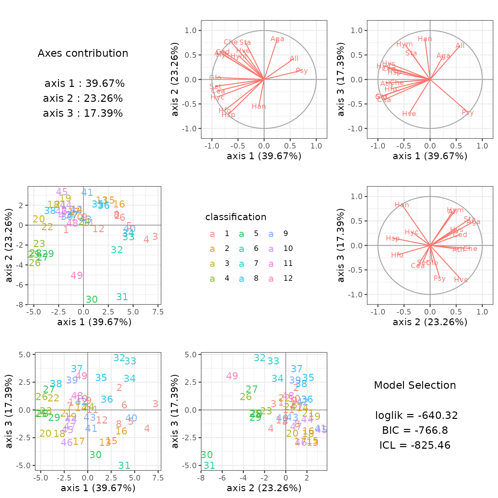
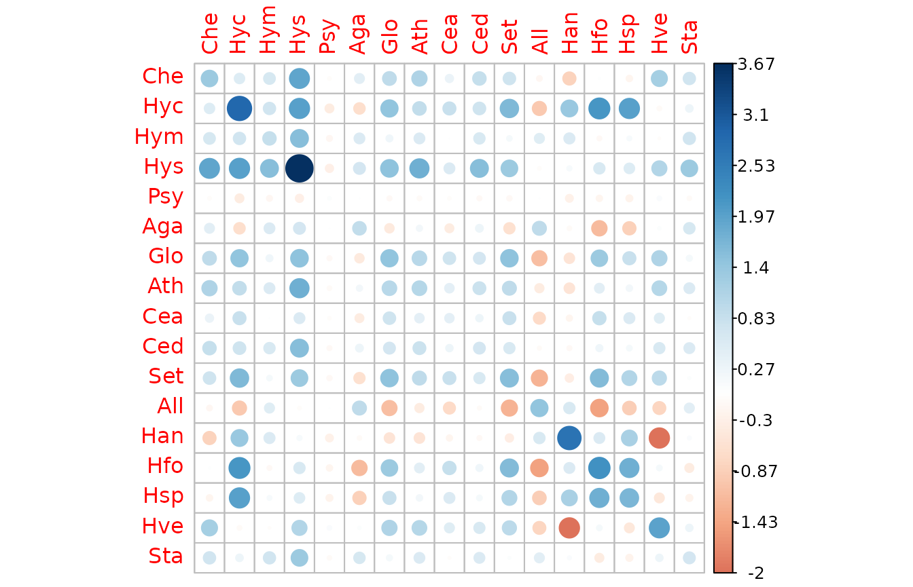
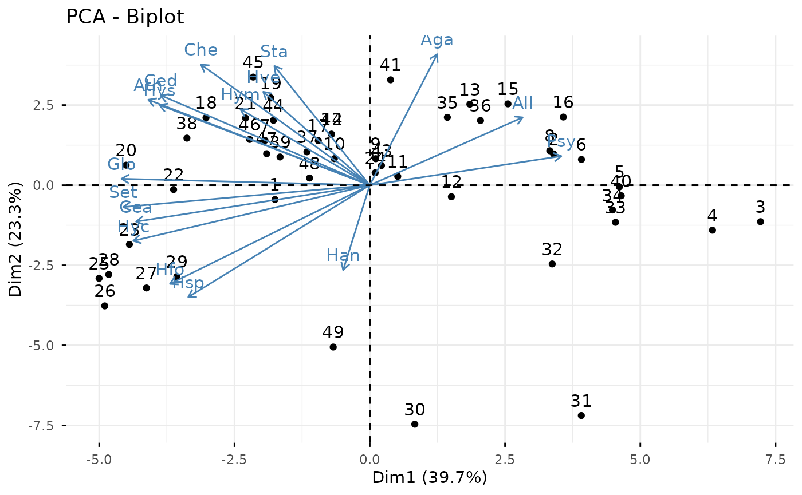
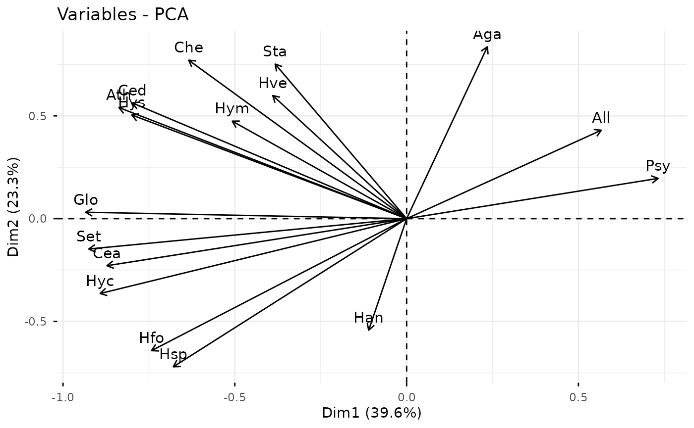
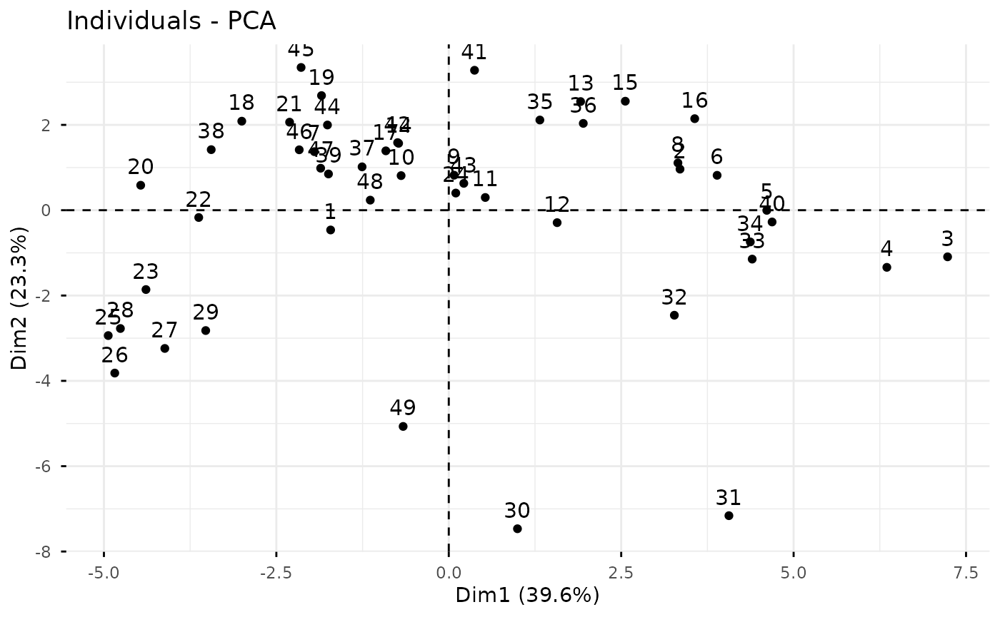
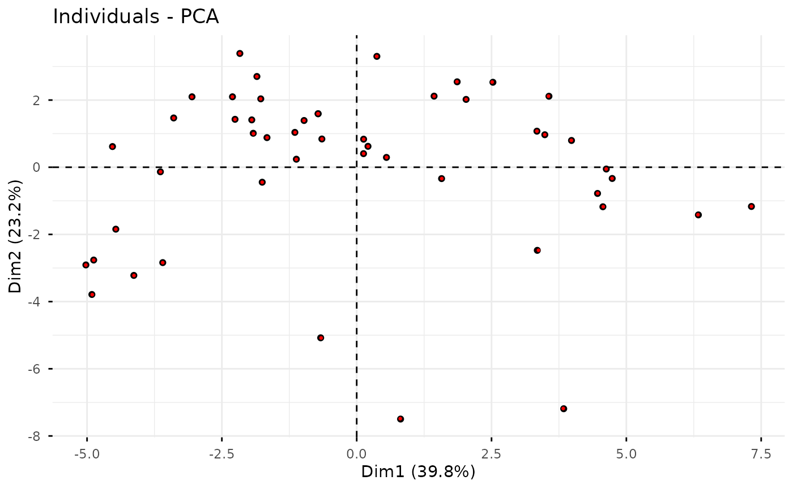
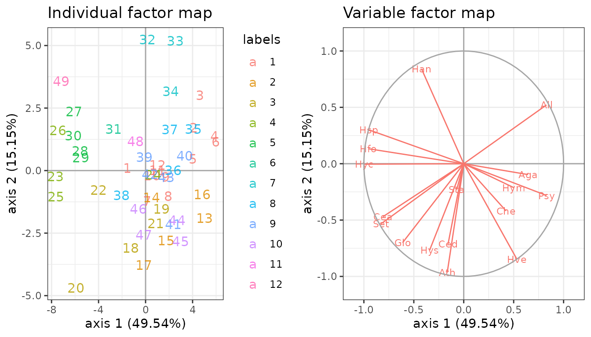
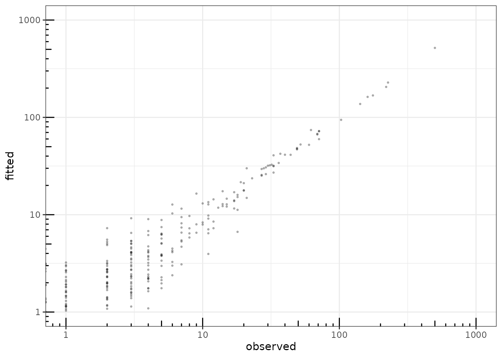

# Dimension reduction of multivariate count data with PLN-PCA

## Preliminaries

This vignette illustrates the standard use of the `PLNPCA` function and
the methods accompanying the R6 Classes `PLNPCAfamily` and `PLNPCAfit`.

### Requirements

The packages required for the analysis are **PLNmodels** plus some
others for data manipulation and representation:

``` r

library(PLNmodels)
library(ggplot2)
library(corrplot)
library(factoextra)
```

The main function `PLNPCA` integrates some features of the **future**
package to perform parallel computing: you can set your plan now to
speed the fit by relying on 2 workers as follows:

``` r

library(future)
plan(multisession, workers = 2)
```

### Data set

We illustrate our point with the trichoptera data set, a full
description of which can be found in [the corresponding
vignette](https://pln-team.github.io/PLNmodels/articles/Trichoptera.md).
Data preparation is also detailed in [the specific
vignette](https://pln-team.github.io/PLNmodels/articles/Import_data.md).

``` r

data(trichoptera)
trichoptera <- prepare_data(trichoptera$Abundance, trichoptera$Covariate)
```

The `trichoptera` data frame stores a matrix of counts
(`trichoptera$Abundance`), a matrix of offsets (`trichoptera$Offset`)
and some vectors of covariates (`trichoptera$Wind`,
`trichoptera$Temperature`, etc.)

### Mathematical background

In the vein of Tipping and Bishop ([1999](#ref-TiB99)), we introduce in
Chiquet et al. ([2018](#ref-PLNPCA)) a probabilistic PCA model for
multivariate count data which is a variant of the Poisson Lognormal
model of Aitchison and Ho ([1989](#ref-AiH89)) (see [the PLN
vignette](https://pln-team.github.io/PLNmodels/articles/PLN.md) as a
reminder). Indeed, it can be viewed as a PLN model with an additional
rank constraint on the covariance matrix $`\boldsymbol\Sigma`$ such that
$`\mathrm{rank}(\boldsymbol\Sigma)= q`$.

This PLN-PCA model can be written in a hierarchical framework where a
sample of $`p`$-dimensional observation vectors $`\mathbf{Y}_i`$ is
related to some $`q`$-dimensional vectors of latent variables
$`\mathbf{W}_i`$ as follows:
``` math
\begin{equation} 
  \begin{array}{rcl}
    \text{latent space }  & \mathbf{W}_i \quad \text{i.i.d.} & \mathbf{W}_i \sim      \mathcal{N}(\mathbf{0}_q, \mathbf{I}_q)  \\
\text{parameter space } &   \mathbf{Z}_i = {\boldsymbol\mu} + \mathbf{C}^\top \mathbf{W}_i & \\
  \text{observation space } &  Y_{ij} | Z_{ij} \quad \text{indep.} & Y_{ij} | Z_{ij} \sim \mathcal{P}\left(\exp\{Z_{ij}\}\right)
  \end{array}
\end{equation}
```

The parameter $`{\boldsymbol\mu}\in\mathbb{R}^p`$ corresponds to the
main effects, the $`p\times q`$ matrix $`\mathbf{C}`$ to the loadings in
the parameter spaces and $`\mathbf{W}_i`$ to the scores of the $`i`$-th
observation in the low-dimensional latent subspace of the parameter
space. The dimension of the latent space $`q`$ corresponds to the number
of axes in the PCA or, in other words, to the rank of
$`\mathbf{C}\mathbf{C}^\intercal`$. An hopefully more intuitive way of
writing this model is the following:
``` math
\begin{equation} 
  \begin{array}{rcl}
  \text{latent space } &   \mathbf{Z}_i \sim \mathcal{N}({\boldsymbol\mu},\boldsymbol\Sigma), \qquad \boldsymbol\Sigma = \mathbf{C}\mathbf{C}^\top \\
  \text{observation space } &  Y_{ij} | Z_{ij} \quad \text{indep.} & Y_{ij} | Z_{ij} \sim \mathcal{P}\left(\exp\{Z_{ij}\}\right),
  \end{array}
\end{equation}
```
where the interpretation of PLN-PCA as a rank-constrained PLN model is
more obvious.

#### Covariates and offsets

Just like PLN, PLN-PCA generalizes to a formulation close to a
multivariate generalized linear model where the main effect is due to a
linear combination of $`d`$ covariates $`\mathbf{x}_i`$ and to a vector
$`\mathbf{o}_i`$ of $`p`$ offsets in sample $`i`$. The latent layer then
reads
``` math
\begin{equation} 
  \mathbf{Z}_i \sim \mathcal{N}({\mathbf{o}_i + \mathbf{x}_i^\top\mathbf{B}},\boldsymbol\Sigma), \qquad \boldsymbol\Sigma = \mathbf{C}\mathbf{C}^\top,
\end{equation}
```
where $`\mathbf{B}`$ is a $`d\times p`$ matrix of regression parameters.

#### Optimization by Variational inference

Dimension reduction and visualization is the main objective in
(PLN)-PCA. To reach this goal, we need to first estimate the model
parameters. Inference in PLN-PCA focuses on the regression parameters
$`\mathbf{B}`$ and on the covariance matrix $`\boldsymbol\Sigma`$.
Technically speaking, we adopt a variational strategy to approximate the
log-likelihood function and optimize the consecutive variational
surrogate of the log-likelihood with a gradient-ascent-based approach.
To this end, we rely on the CCSA algorithm of Svanberg
([2002](#ref-Svan02)) implemented in the C++ library ([Johnson
2011](#ref-nlopt)), which we link to the package. Technical details can
be found in Chiquet et al. ([2018](#ref-PLNPCA)).

## Analysis of trichoptera data with a PLNPCA model

In the package, the PLNPCA model is adjusted with the function `PLNPCA`,
which we review in this section. This function adjusts the model for a
series of value of $`q`$ and provides a collection of objects
`PLNPCAfit` stored in an object with class `PLNPCAfamily`.

The class `PLNPCAfit` inherits from the class `PLNfit`, so we strongly
recommend the reader to be comfortable with `PLN` and `PLNfit` before
using `PLNPCA` (see [the PLN
vignette](https://pln-team.github.io/PLNmodels/articles/PLN.md)).

### A model with latent main effects for the Trichoptera data set

#### Adjusting a collection of fits

We fit a collection of $`q`$ models as follows:

``` r

PCA_models <- PLNPCA(
  Abundance ~ 1 + offset(log(Offset)),
  data  = trichoptera, 
  ranks = 1:4
)
```

    ## 
    ##  Initialization...
    ## 
    ##  Adjusting 4 PLN models for PCA analysis.
    ##   Rank approximation = 1      Rank approximation = 2      Rank approximation = 3      Rank approximation = 4 
    ##  Post-treatments
    ##  DONE!

Note the use of the `formula` object to specify the model, similar to
the one used in the function `PLN`.

#### Structure of `PLNPCAfamily`

The `PCA_models` variable is an `R6` object with class `PLNPCAfamily`,
which comes with a couple of methods. The most basic is the `show/print`
method, which sends a brief summary of the estimation process:

``` r

PCA_models
```

    ## --------------------------------------------------------
    ## COLLECTION OF 4 POISSON LOGNORMAL MODELS
    ## --------------------------------------------------------
    ##  Task: Principal Component Analysis
    ## ========================================================
    ##  - Ranks considered: from 1 to 4
    ##  - Best model (greater BIC): rank = 4
    ##  - Best model (greater ICL): rank = 3

One can also easily access the successive values of the criteria in the
collection

``` r

PCA_models$criteria %>% knitr::kable()
```

| param | nb_param |     loglik |        BIC |        AIC |        ICL |
|------:|---------:|-----------:|-----------:|-----------:|-----------:|
|     1 |       34 | -1042.0394 | -1108.2004 | -1076.0394 | -1120.5893 |
|     2 |       50 |  -731.6823 |  -828.9778 |  -781.6823 |  -860.3102 |
|     3 |       65 |  -640.3650 |  -766.8492 |  -705.3650 |  -825.0339 |
|     4 |       79 |  -599.6222 |  -753.3491 |  -678.6222 |  -844.7847 |

A quick diagnostic of the optimization process is available via the
`convergence` field:

``` r

PCA_models$convergence  %>% knitr::kable()
```

|       | param | nb_param | status | backend | objective | iterations |
|:------|------:|:---------|:-------|:--------|:----------|:-----------|
| out   |     1 | 34       | 3      | nlopt   | -36014.27 | 606        |
| elt   |     2 | 50       | 3      | nlopt   | -36324.63 | 1536       |
| elt.1 |     3 | 65       | 3      | nlopt   | -36415.95 | 947        |
| elt.2 |     4 | 79       | 3      | nlopt   | -36456.69 | 1226       |

Comprehensive information about `PLNPCAfamily` is available via
[`?PLNPCAfamily`](https://pln-team.github.io/PLNmodels/reference/PLNPCAfamily.md).

#### Model selection of rank $`q`$

The `plot` method of `PLNPCAfamily` displays evolution of the criteria
mentioned above, and is a good starting point for model selection:

``` r

plot(PCA_models)
```


Note that we use the original definition of the BIC/ICL criterion
($`\texttt{loglik} - \frac{1}{2}\texttt{pen}`$), which is on the same
scale as the log-likelihood. A [popular
alternative](https://en.wikipedia.org/wiki/Bayesian_information_criterion)
consists in using $`-2\texttt{loglik} + \texttt{pen}`$ instead. You can
do so by specifying `reverse = TRUE`:

``` r

plot(PCA_models, reverse = TRUE)
```


In this case, the variational lower bound of the log-likelihood is
hopefully strictly increasing (or rather decreasing if using
`reverse = TRUE`) with the number of axes (or subspace dimension). Also
note the (approximated) $`R^2`$ which is displayed for each value of
$`q`$ (see ([Chiquet et al. 2018](#ref-PLNPCA)) for details on its
computation).

From this plot, we can see that the best model in terms of BIC or ICL is
obtained for a rank $`q=4`$ or $`q=3`$. We may extract the corresponding
model with the method `getBestModel("ICL")`. A model with a specific
rank can be extracted with the
[`getModel()`](https://pln-team.github.io/PLNmodels/reference/getModel.md)
method:

``` r

myPCA_ICL <- getBestModel(PCA_models, "ICL") 
myPCA_BIC <- getModel(PCA_models, 3) # getBestModel(PCA_models, "BIC")  is equivalent here 
```

#### Structure of `PLNPCAfit`

Objects `myPCA_ICL` and `myPCA_BIC` are `R6Class` objects of class
`PLNPCAfit` which in turns own a couple of methods, some inherited from
`PLNfit` and some others specific, mostly for visualization purposes.
The `plot` method provides individual maps and correlation circles as in
usual PCA. If an additional classification exists for the observations –
which is the case here with the available classification of the trapping
nights – , it can be passed as an argument to the function.[^1]

``` r

plot(myPCA_ICL, ind_cols = trichoptera$Group)
```



Among other fields and methods (see
[`?PLNPCAfit`](https://pln-team.github.io/PLNmodels/reference/PLNPCAfit.md)
for a comprehensive view), the most interesting for the end-user in the
context of PCA are

- the regression coefficient matrix

``` r

coef(myPCA_ICL) %>% head() %>% knitr::kable()
```

|  | Che | Hyc | Hym | Hys | Psy | Aga | Glo | Ath | Cea | Ced | Set | All | Han | Hfo | Hsp | Hve | Sta |
|:---|---:|---:|---:|---:|---:|---:|---:|---:|---:|---:|---:|---:|---:|---:|---:|---:|---:|
| (Intercept) | -7.434211 | -8.057369 | -3.018784 | -6.87061 | -0.5366141 | -3.834332 | -6.38331 | -5.804006 | -7.311393 | -3.513852 | -4.084953 | -5.04075 | -4.33353 | -5.937828 | -3.951039 | -7.146032 | -2.58505 |

- the estimated covariance matrix $`\boldsymbol\Sigma`$ with fixed rank

``` r

sigma(myPCA_ICL) %>% corrplot(is.corr = FALSE)
```



- the rotation matrix (in the latent space)

``` r

myPCA_ICL$rotation %>% head() %>% knitr::kable()
```

|     |        PC1 |        PC2 |        PC3 |
|:----|-----------:|-----------:|-----------:|
| Che | -0.2029934 |  0.3248846 | -0.0291819 |
| Hyc | -0.4328807 | -0.2257067 |  0.2086481 |
| Hym | -0.1300347 |  0.1694486 |  0.2947345 |
| Hys | -0.4318781 |  0.3662567 |  0.2759175 |
| Psy |  0.0511372 |  0.0172489 | -0.0713042 |
| Aga |  0.0679111 |  0.2914636 |  0.1976951 |

- the principal components values (or scores)

``` r

myPCA_ICL$scores %>% head() %>% knitr::kable()
```

|       PC1 |        PC2 |        PC3 |
|----------:|-----------:|-----------:|
| -1.752095 | -0.4456495 |  0.7081145 |
|  3.487919 |  0.9677894 |  2.0298173 |
|  7.319281 | -1.1679131 |  0.5483579 |
|  6.335651 | -1.4185459 | -1.6658207 |
|  4.628082 | -0.0531473 | -1.0153053 |
|  3.983035 |  0.7969679 |  0.4444038 |

`PLNPCAfit` also inherits from the methods of `PLNfit` (see the
[appropriate
vignette](https://pln-team.github.io/PLNmodels/articles/PLN.md)). Most
are recalled via the show method:

``` r

myPCA_ICL
```

    ## Poisson Lognormal with rank constrained for PCA (rank = 3)
    ## ==================================================================
    ##  nb_param   loglik      BIC      AIC      ICL
    ##        65 -640.365 -766.849 -705.365 -825.034
    ## ==================================================================
    ## * Useful fields
    ##     $model_par, $latent, $latent_pos, $var_par, $optim_par
    ##     $loglik, $BIC, $ICL, $loglik_vec, $nb_param, $criteria
    ## * Useful S3 methods
    ##     print(), coef(), sigma(), vcov(), fitted()
    ##     predict(), predict_cond(), standard_error()
    ## * Additional fields for PCA
    ##     $percent_var, $corr_circle, $scores, $rotation, $eig, $var, $ind
    ## * Additional S3 methods for PCA
    ##     plot.PLNPCAfit()

### Additional visualization

We provide simple plotting functions but a wealth of plotting utilities
are available for factorial analyses results. The following bindings
allow you to use widely popular tools to make your own plots: `$eig`,
`$var` and `$ind`.

``` r

## All summaries associated to the individuals
str(myPCA_ICL$ind)
```

    ## List of 4
    ##  $ coord  : num [1:49, 1:3] -1.75 3.49 7.32 6.34 4.63 ...
    ##   ..- attr(*, "dimnames")=List of 2
    ##   .. ..$ : chr [1:49] "1" "2" "3" "4" ...
    ##   .. ..$ : chr [1:3] "Dim.1" "Dim.2" "Dim.3"
    ##  $ cos2   : num [1:49, 1:3] 0.814 0.706 0.97 0.893 0.954 ...
    ##   ..- attr(*, "dimnames")=List of 2
    ##   .. ..$ : chr [1:49] "1" "2" "3" "4" ...
    ##   .. ..$ : chr [1:3] "Dim.1" "Dim.2" "Dim.3"
    ##  $ contrib: num [1:49, 1:3] 0.621 2.463 10.845 8.126 4.336 ...
    ##   ..- attr(*, "dimnames")=List of 2
    ##   .. ..$ : chr [1:49] "1" "2" "3" "4" ...
    ##   .. ..$ : chr [1:3] "Dim.1" "Dim.2" "Dim.3"
    ##  $ dist   : Named num [1:49] 1.94 4.15 7.43 6.7 4.74 ...
    ##   ..- attr(*, "names")= chr [1:49] "1" "2" "3" "4" ...

``` r

## Coordinates of the individuals in the principal plane
head(myPCA_ICL$ind$coord)
```

    ##       Dim.1       Dim.2      Dim.3
    ## 1 -1.752095 -0.44564951  0.7081145
    ## 2  3.487918  0.96778936  2.0298173
    ## 3  7.319281 -1.16791306  0.5483579
    ## 4  6.335651 -1.41854591 -1.6658207
    ## 5  4.628082 -0.05314732 -1.0153053
    ## 6  3.983035  0.79696792  0.4444038

You can also use high level functions from the
[factoextra](https://cran.r-project.org/package=factoextra) package to
extract relevant informations

``` r

## Eigenvalues
factoextra::get_eig(myPCA_ICL)
```

    ##       eigenvalue variance.percent cumulative.variance.percent
    ## Dim.1   493.9615         39.82669                    39.82669
    ## Dim.2   287.6743         23.19435                    63.02104
    ## Dim.3   214.6742         17.30857                    80.32961

``` r

## Variables
factoextra::get_pca_var(myPCA_ICL)
```

    ## Principal Component Analysis Results for variables
    ##  ===================================================
    ##   Name       Description                                    
    ## 1 "$coord"   "Coordinates for the variables"                
    ## 2 "$cor"     "Correlations between variables and dimensions"
    ## 3 "$cos2"    "Cos2 for the variables"                       
    ## 4 "$contrib" "contributions of the variables"

``` r

## Individuals
factoextra::get_pca_ind(myPCA_ICL)
```

    ## Principal Component Analysis Results for individuals
    ##  ===================================================
    ##   Name       Description                       
    ## 1 "$coord"   "Coordinates for the individuals" 
    ## 2 "$cos2"    "Cos2 for the individuals"        
    ## 3 "$contrib" "contributions of the individuals"

And some of the very nice plotting methods such as biplots, correlation
circles and scatter plots of the scores.

``` r

factoextra::fviz_pca_biplot(myPCA_ICL)
```



``` r

factoextra::fviz_pca_var(myPCA_ICL)
```



``` r

factoextra::fviz_pca_ind(myPCA_ICL)
```



### Projecting new data in the PCA space

You can project new data in the PCA space although it’s slightly
involved at the moment. We demonstrate that by projecting the original
data on top of the original graph. As expected, the projections of the
*new* data points (small red points) are superimposed to the original
data points (large black points).

``` r

## Project newdata into PCA space
new_scores <- myPCA_ICL$project(newdata = trichoptera)
## Overprint
p <- factoextra::fviz_pca_ind(myPCA_ICL, geom = "point", col.ind = "black")
factoextra::fviz_add(p, new_scores, geom = "point", color = "red", 
                     addlabel = FALSE, pointsize = 0.5)
```



### A model accounting for meteorological covariates

A contribution of PLN-PCA is to let the possibility to taking into
account some covariates in the parameter space. Such a strategy often
completely changes the interpretation of PCA. Indeed, the covariates are
often responsible for some strong structure in the data. The effect of
the covariates should be removed since they are often quite obvious for
the analyst and may hide some more important and subtle effects.

In the case at hand, the covariates corresponds to the meteorological
variables. Let us try to introduce some of them in our model, for
instance, the temperature, the wind and the cloudiness. This can be done
thanks to the model formula:

``` r

PCA_models_cov <- 
  PLNPCA(
    Abundance ~ 1 + offset(log(Offset)) + Temperature + Wind + Cloudiness,
    data  = trichoptera,
    ranks = 1:4
  )
```

    ## 
    ##  Initialization...
    ## 
    ##  Adjusting 4 PLN models for PCA analysis.
    ##   Rank approximation = 1      Rank approximation = 2      Rank approximation = 3      Rank approximation = 4 
    ##  Post-treatments
    ##  DONE!

Again, the best model is obtained for $`q=3`$ classes.

``` r

plot(PCA_models_cov)
```


``` r

myPCA_cov <- getBestModel(PCA_models_cov, "ICL")
```

Suppose that we want to have a closer look to the first two axes. This
can be done thanks to the plot method:

``` r

gridExtra::grid.arrange(
  plot(myPCA_cov, map = "individual", ind_cols = trichoptera$Group, plot = FALSE),
  plot(myPCA_cov, map = "variable", plot = FALSE),
  ncol = 2
)
```



We can check that the fitted value of the counts – even with this
low-rank covariance matrix – are close to the observed ones:

``` r

data.frame(
  fitted   = as.vector(fitted(myPCA_cov)),
  observed = as.vector(trichoptera$Abundance)
) %>% 
  ggplot(aes(x = observed, y = fitted)) + 
    geom_point(size = .5, alpha =.25 ) + 
    scale_x_log10(limits = c(1,1000)) + 
    scale_y_log10(limits = c(1,1000)) + 
    theme_bw() + annotation_logticks()
```



fitted value vs. observation

When you are done, do not forget to get back to the standard sequential
plan with *future*.

``` r

future::plan("sequential")
```

## References

Aitchison, J., and C. H. Ho. 1989. “The Multivariate Poisson-Log Normal
Distribution.” *Biometrika* 76 (4): 643–53.

Chiquet, Julien, Mahendra Mariadassou, and Stéphane Robin. 2018.
“Variational Inference for Probabilistic Poisson PCA.” *The Annals of
Applied Statistics* 12: 2674–98.

Johnson, Steven G. 2011. *The NLopt Nonlinear-Optimization Package*.
<https://nlopt.readthedocs.io/en/latest/>.

Svanberg, Krister. 2002. “A Class of Globally Convergent Optimization
Methods Based on Conservative Convex Separable Approximations.” *SIAM
Journal on Optimization* 12 (2): 555–73.

Tipping, M. E, and C. M Bishop. 1999. “Probabilistic Principal Component
Analysis.” *Journal of the Royal Statistical Society: Series B
(Statistical Methodology)* 61 (3): 611–22.

[^1]: With our PLN-PCA (and any pPCA model for count data, where
    successive models are not nested), it is important to performed the
    model selection of $`q`$ prior to visualization, since the model
    with rank $`q=3`$ is not nested in the model with rank $`q=4`$.
    Hence, percentage of variance must be interpreted with care: it sums
    to 100% but must be put in perspective with the model $`R^2`$,
    giving an approximation of the total percentage of variance
    explained with the current model.
