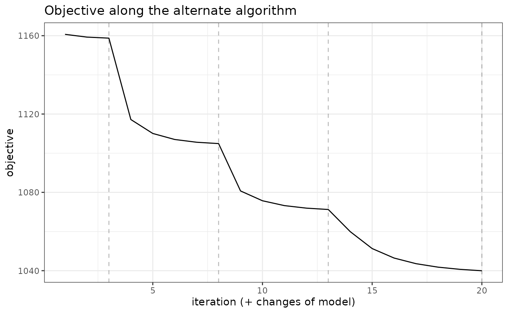
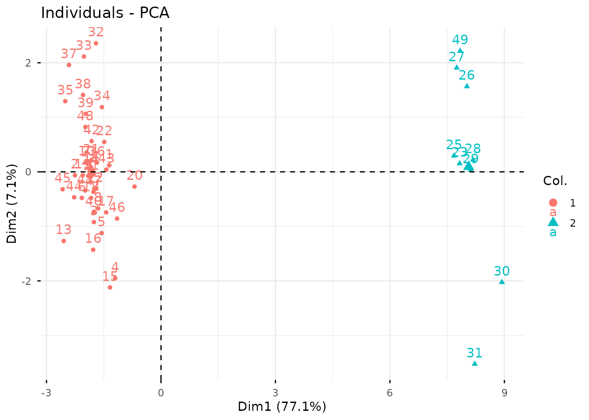

# Clustering of multivariate count data with PLN-mixture

## Preliminaries

This vignette illustrates the standard use of the `PLNmixture` function
and the methods accompanying the R6 Classes `PLNmixturefamily` and
`PLNmixturefit`.

### Requirements

The packages required for the analysis are **PLNmodels** plus some
others for data manipulation and representation:

``` r

library(PLNmodels)
library(factoextra)
```

The main function `PLNmixture` integrates some features of the
**future** package to perform parallel computing: you can set your plan
to speed the fit by relying on 2 workers as follows:

``` r

library(future)
plan(multisession, workers = 2)
```

### Data set

We illustrate our point with the trichoptera data set, a full
description of which can be found in [the corresponding
vignette](https://pln-team.github.io/PLNmodels/articles/Trichoptera.md).
Data preparation is also detailed in [the specific
vignette](https://pln-team.github.io/PLNmodels/articles/Import_data.md).

``` r

data(trichoptera)
trichoptera <- prepare_data(trichoptera$Abundance, trichoptera$Covariate)
```

The `trichoptera` data frame stores a matrix of counts
(`trichoptera$Abundance`), a matrix of offsets (`trichoptera$Offset`)
and some vectors of covariates (`trichoptera$Wind`,
`trichoptera$Temperature`, etc.)

### Mathematical background

PLN-mixture for multivariate count data is a variant of the Poisson
Lognormal model of Aitchison and Ho ([1989](#ref-AiH89)) (see [the PLN
vignette](https://pln-team.github.io/PLNmodels/articles/PLN.md) as a
reminder) which can be viewed as a PLN model with an additional mixture
layer in the model: the latent observations found in the first layer are
assumed to be drawn from a mixture of $`K`$ multivariate Gaussian
components. Each component $`k`$ has a prior probability
$`p(i \in k) = \pi_k`$ such that $`\sum_k \pi_k = 1`$. We denote by
$`C_i\in \{1,\dots,K\}`$ the multinomial variable
$`\mathcal{M}(1,\boldsymbol{\pi} = (\pi_1,\dots,\pi_K))`$ describing the
component to which observation $`i`$ belongs to. Introducing this
additional layer, our PLN mixture model is as follows

``` math
\begin{array}{rcl}
\text{layer 2 (clustering)} & \mathbf{C}\_i \sim \mathcal{M}(1,\boldsymbol{\pi}) \\
\text{layer 1 (Gaussian)} & \mathbf{Z}\_i | \, \mathbf{C}\_i = k
\sim \mathcal{N}({\boldsymbol\mu}^{(k)},
{\boldsymbol\Sigma}^{(k)}), \\ 
\text{observation space } & Y_{ij} \| Z_{ij} \quad \text{indep.} & \mathbf{Y}_i |
\mathbf{Z}_i\sim\mathcal{P}\left(\exp\{\mathbf{Z}_i\}\right).
\end{array}
```

#### Covariates and offsets

Just like PLN, PLN-mixture generalizes to a formulation where the main
effect is due to a linear combination of $`d`$ covariates
$`\mathbf{x}_i`$ and to a vector $`\mathbf{o}_i`$ of $`p`$ offsets in
sample $`i`$ in each mixture component. The latent layer then reads

``` math
\mathbf{Z}_i | \mathbf{C}_i = k \, \sim
\mathcal{N}({\mathbf{o}_i +
\mathbf{x}_i^{\top}{\mathbf{B}} + \boldsymbol\mu}^{(k)},{\boldsymbol\Sigma}^{(k)}),
```

where $`{\mathbf{B}}`$ is a $`d\times p`$ matrix of regression
parameters common to all the mixture components.

#### Parametrization of the covariance of the mixture models

When using parametric mixture models like Gaussian mixture models, it is
generally not recommended to have covariances matrices
$`{\boldsymbol\Sigma}^{(k)}`$ with no special restriction, especially
when dealing with a large number of variables. Indeed, the total number
of parameters to estimate in such unrestricted model can become
prohibitive.

To reduce the computational burden and avoid over-fitting the data, two
different, more constrained parametrizations of the covariance matrices
of each component are currently implemented in the `PLNmodels` package
(on top of the general form of $`\Sigma_k`$):

``` math
\begin{equation*}
\begin{array}{rrcll}
    \text{diagonal covariances:} & \Sigma_k & = &\mathrm{diag}({d}_k) & \text{($2 K p$ parameters),} \\[1.5ex]
    \text{spherical covariances:} & \Sigma_k & = &  \sigma_k^2 {I} & \text{($K (p + 1)$ parameters).} 
\end{array}
\end{equation*}
```

The diagonal structure assumes that, given the group membership of a
site, all variable abundances are independent. The spherical structure
further assumes that all species have the same biological variability.
In particular, in both parametrisations, all observed covariations are
caused only by the group structure.

For readers familiar with the `mclust` `R` package ([Fraley and Raftery
1999](#ref-fraley1999)), which implements Gaussian mixture models with
many variants of covariance matrices of each component, the spherical
model corresponds to `VII` (spherical, unequal volume) and the diagonal
model to `VVI` (diagonal, varying volume and shape). {Using constrained
forms of the covariance matrices enables} PLN-mixture to {provide a
clustering} even when the number of sites $`n`$ remains of the same
order, or smaller, than the number of species $`p`$.

#### Optimization by Variational inference

Just like with all models fitted in PLNmodels, we adopt a variational
strategy to approximate the log-likelihood function and optimize the
consecutive variational surrogate of the log-likelihood with a
gradient-ascent-based approach. In this case, it is not too difficult to
show that PLN-mixture can be obtained by optimizing a collection of
weighted standard PLN models.

## Analysis of trichoptera data with a PLN-mixture model

In the package, the PLN-mixture model is adjusted with the function
`PLNmixture`, which we review in this section. This function adjusts the
model for a series of value of $`k`$ and provides a collection of
objects `PLNmixturefit` stored in an object with class
`PLNmixturefamily`.

The class `PLNmixturefit` contains a collection of components
constituting the mixture, each of whom inherits from the class `PLNfit`,
so we strongly recommend the reader to be comfortable with `PLN` and
`PLNfit` before using `PLNmixture` (see [the PLN
vignette](https://pln-team.github.io/PLNmodels/articles/PLN.md)).

### A mixture model with a latent main effects for the Trichoptera data set

#### Adjusting a collection of fits

We fit a collection of $`K=5`$ models with one iteration of forward
smoothing of the log-likelihood as follows:

``` r

mixture_models <- PLNmixture(
  Abundance ~ 1 + offset(log(Offset)),
  data  = trichoptera,
  clusters = 1:4
)
```

    ## 
    ##  Initialization...
    ## 
    ##  Adjusting 4 PLN mixture models.
    ##  number of cluster = 1   number of cluster = 2   number of cluster = 3   number of cluster = 4 
    ## 
    ##  Smoothing PLN mixture models.
    ##    Going backward +++                                                                                                       Going forward +++                                                                                                    
    ##  Post-treatments
    ##  DONE!

Note the use of the `formula` object to specify the model, similar to
the one used in the function `PLN`.

#### Structure of `PLNmixturefamily`

The `mixture_models` variable is an `R6` object with class
`PLNmixturefamily`, which comes with a couple of methods. The most basic
is the `show/print` method, which outputs a brief summary of the
estimation process:

``` r

mixture_models
```

    ## --------------------------------------------------------
    ## COLLECTION OF 4 POISSON LOGNORMAL MODELS
    ## --------------------------------------------------------
    ##  Task: Mixture Model 
    ## ========================================================
    ##  - Number of clusters considered: from 1 to 4 
    ##  - Best model (regarding BIC): cluster = 2 
    ##  - Best model (regarding ICL): cluster = 4

One can also easily access the successive values of the criteria in the
collection

``` r

mixture_models$criteria %>% knitr::kable()
```

| param | nb_param |    loglik |       BIC |       ICL |
|------:|---------:|----------:|----------:|----------:|
|     1 |       18 | -1158.758 | -1193.785 | -2179.896 |
|     2 |       37 | -1104.907 | -1176.906 | -2030.186 |
|     3 |       56 | -1071.246 | -1180.217 | -1950.727 |
|     4 |       75 | -1039.964 | -1185.908 | -1842.654 |

A quick diagnostic of the optimization process is available via the
`convergence` field:

``` r

mixture_models$convergence  %>% knitr::kable()
```

|       | param | nb_param | objective | convergence  | outer_iterations |
|:------|------:|:---------|:----------|:-------------|:-----------------|
| out   |     1 | 18       | 1158.758  | 0.0004542649 | 3                |
| elt   |     2 | 37       | 1104.907  | 0.00061787   | 5                |
| elt.1 |     3 | 56       | 1071.246  | 0.0006504216 | 5                |
| elt.2 |     4 | 75       | 1039.964  | 0.0006970669 | 7                |

A visual representation of the optimization can be obtained be
representing the objective function

``` r

mixture_models$plot_objective()
```



Comprehensive information about `PLNmixturefamily` is available via
[`?PLNmixturefamily`](https://pln-team.github.io/PLNmodels/reference/PLNmixturefamily.md).

#### Model selection

The `plot` method of `PLNmixturefamily` displays evolution of the
criteria mentioned above, and is a good starting point for model
selection:

``` r

plot(mixture_models)
```


Note that we use the original definition of the BIC/ICL criterion
($`\texttt{loglik} - \frac{1}{2}\texttt{pen}`$), which is on the same
scale as the log-likelihood. A [popular
alternative](https://en.wikipedia.org/wiki/Bayesian_information_criterion)
consists in using $`-2\texttt{loglik} + \texttt{pen}`$ instead. You can
do so by specifying `reverse = TRUE`:

``` r

plot(mixture_models, reverse = TRUE)
```


From those plots, we can see that the best model in terms of BIC is
obtained for a number of clusters of 2. We may extract the corresponding
model with the method
[`getBestModel()`](https://pln-team.github.io/PLNmodels/reference/getBestModel.md).
A model with a specific number of clusters can also be extracted with
the
[`getModel()`](https://pln-team.github.io/PLNmodels/reference/getModel.md)
method:

``` r

myMix_BIC <- getBestModel(mixture_models, "BIC")
myMix_2   <- getModel(mixture_models, 2)
```

#### Structure of `PLNmixturefit`

Object `myMix_BIC` is an `R6Class` object with class `PLNmixturefit`
which in turns has a couple of methods. A good place to start is the
`show/print` method:

``` r

myMix_BIC
```

    ## Poisson Lognormal mixture model with 2 components and spherical covariances.
    ## * Useful fields
    ##     $posteriorProb, $memberships, $mixtureParam, $group_means
    ##     $model_par, $latent, $latent_pos, $optim_par
    ##     $loglik, $BIC, $ICL, $loglik_vec, $nb_param, $criteria
    ##     $component[[i]] (a PLNfit with associated methods and fields)
    ## * Useful S3 methods
    ##     print(), coef(), sigma(), fitted(), predict()

#### Specific fields

The user can easily access several fields of the `PLNmixturefit` object
using active binding or `S3` methods:

- the vector of group memberships:

``` r

myMix_BIC$memberships
```

    ##  [1] 1 1 1 1 1 1 1 1 1 1 1 1 1 1 1 1 1 1 1 1 1 1 2 1 2 2 2 2 2 2 2 1 1 1 1 1 1 1
    ## [39] 1 1 1 1 1 1 1 1 1 1 2

- the group proportions:

``` r

myMix_BIC$mixtureParam
```

    ## [1] 0.8163265 0.1836735

- the posterior probabilities (often close to the boundaries
  $`\{0,1\}`$):

``` r

myMix_BIC$posteriorProb %>% head() %>% knitr::kable(digits = 3)
```

|     |     |
|----:|----:|
|   1 |   0 |
|   1 |   0 |
|   1 |   0 |
|   1 |   0 |
|   1 |   0 |
|   1 |   0 |

- a list of $`K`$$`p \times p`$ covariance matrices
  $`\hat{\boldsymbol{\Sigma}}`$ (here spherical variances):

``` r

sigma(myMix_BIC) %>% purrr::map(as.matrix) %>% purrr::map(diag)
```

    ## [[1]]
    ##       Che       Hyc       Hym       Hys       Psy       Aga       Glo       Ath 
    ## 0.8397512 0.8397512 0.8397512 0.8397512 0.8397512 0.8397512 0.8397512 0.8397512 
    ##       Cea       Ced       Set       All       Han       Hfo       Hsp       Hve 
    ## 0.8397512 0.8397512 0.8397512 0.8397512 0.8397512 0.8397512 0.8397512 0.8397512 
    ##       Sta 
    ## 0.8397512 
    ## 
    ## [[2]]
    ##      Che      Hyc      Hym      Hys      Psy      Aga      Glo      Ath 
    ## 1.014301 1.014301 1.014301 1.014301 1.014301 1.014301 1.014301 1.014301 
    ##      Cea      Ced      Set      All      Han      Hfo      Hsp      Hve 
    ## 1.014301 1.014301 1.014301 1.014301 1.014301 1.014301 1.014301 1.014301 
    ##      Sta 
    ## 1.014301

- the regression coefficient matrix and other model of parameters
  (results not shown here, redundant with other fields)

``` r

coef(myMix_BIC, 'main')       # equivalent to myMix_BIC$model_par$Theta
coef(myMix_BIC, 'mixture')    # equivalent to myMix_BIC$model_par$Pi, myMix_BIC$mixtureParam
coef(myMix_BIC, 'means')      # equivalent to myMix_BIC$model_par$Mu, myMix_BIC$group_means
coef(myMix_BIC, 'covariance') # equivalent to myMix_BIC$model_par$Sigma, sigma(myMix_BIC)
```

- the $`p \times K`$ matrix of group means $`\mathbf{M}`$

``` r

myMix_BIC$group_means %>% head() %>% knitr::kable(digits = 2)
```

|     | Intercept | Intercept.1 |
|:----|----------:|------------:|
| Che |     -7.23 |      -13.41 |
| Hyc |     -8.44 |       -7.71 |
| Hym |     -2.68 |       -4.87 |
| Hys |     -6.64 |       -8.38 |
| Psy |     -0.51 |       -0.93 |
| Aga |     -3.76 |       -6.96 |

In turn, each component of a `PLNmixturefit` is a `PLNfit` object (see
the corresponding
[vignette](https://pln-team.github.io/PLNmodels/articles/PLN.md))

``` r

myMix_BIC$components[[1]]
```

    ## A multivariate Poisson Lognormal fit with spherical covariance model.
    ## ==================================================================
    ##  nb_param   loglik      BIC      AIC       ICL
    ##        18 -828.888 -863.914 -846.888 -1680.346
    ## ==================================================================
    ## * Useful fields
    ##     $model_par, $latent, $latent_pos, $var_par, $optim_par
    ##     $loglik, $BIC, $ICL, $loglik_vec, $nb_param, $criteria
    ## * Useful S3 methods
    ##     print(), coef(), sigma(), vcov(), fitted()
    ##     predict(), predict_cond(), standard_error()

The `PLNmixturefit` class also benefits from two important methods:
`plot` and `predict`.

#### `plot` method

We can visualize the clustered latent position by performing a PCA on
the latent layer:

``` r

plot(myMix_BIC, "pca")
```


We can also plot the data matrix with samples reordered by clusters to
check whether it exhibits strong pattern or not. The limits between
clusters are highlighted by grey lines.

``` r

plot(myMix_BIC, "matrix")
```


#### `predict` method

For PLNmixture, the goal of `predict` is to predict the membership based
on observed newly *species counts*.

By default, the `predict` use the argument `type = "posterior"` to
output the matrix of posterior probabilities $`\hat{\pi}_k`$

``` r

predicted.class <- predict(myMix_BIC, newdata = trichoptera)
## equivalent to 
## predicted.class <- predict(myMIX_BIC, newdata = trichoptera,  type = "posterior")
predicted.class %>% head() %>% knitr::kable(digits = 2)
```

|     |     |
|----:|----:|
|   1 |   0 |
|   1 |   0 |
|   1 |   0 |
|   1 |   0 |
|   1 |   0 |
|   1 |   0 |

Setting `type = "response"`, we can predict the most likely cluster
$`\hat{k} = \arg\max_{k = 1\dots K} \{ \hat{\pi_k}\}`$ instead:

``` r

predicted.class <- predict(myMix_BIC, newdata = trichoptera, 
                           prior = myMix_BIC$posteriorProb,  type = "response")
predicted.class
```

    ##  1  2  3  4  5  6  7  8  9 10 11 12 13 14 15 16 17 18 19 20 21 22 23 24 25 26 
    ##  1  1  1  1  1  1  1  1  1  1  1  1  1  1  1  1  1  1  1  1  1  1  2  1  2  2 
    ## 27 28 29 30 31 32 33 34 35 36 37 38 39 40 41 42 43 44 45 46 47 48 49 
    ##  2  2  2  2  2  1  1  1  1  1  1  1  1  1  1  1  1  1  1  1  1  1  2 
    ## Levels: 1 2

We can assess that the predictions are quite similar to the real group
(*this is not a proper validation of the method as we used data set for
both model fitting and prediction and are thus at risk of overfitting*).

Finally, we can get the coordinates of the new data on the same graph at
the original ones with `type = "position"`. This is done by averaging
the latent positions $`\hat{\mathbf{Z}}_i + \boldsymbol{\mu}_k`$ (found
when the sample is assumed to come from group $`k`$) and weighting them
with the $`\hat{\pi}_k`$. Some samples, have compositions that put them
very far from their group mean.

``` r

predicted.position <- predict(myMix_BIC, newdata = trichoptera, 
                              prior = myMix_BIC$posteriorProb, type = "position")
prcomp(predicted.position) %>% 
  factoextra::fviz_pca_ind(col.ind = predicted.class)
```



When you are done, do not forget to get back to the standard sequential
plan with *future*.

``` r

future::plan("sequential")
```

## References

Aitchison, J., and C. H. Ho. 1989. “The Multivariate Poisson-Log Normal
Distribution.” *Biometrika* 76 (4): 643–53.

Fraley, Chris, and Adrian E. Raftery. 1999. “MCLUST: Software for
Model-Based Cluster Analysis.” *Journal of Classification* 16 (2):
297–306. <https://doi.org/10.1007/s003579900058>.
