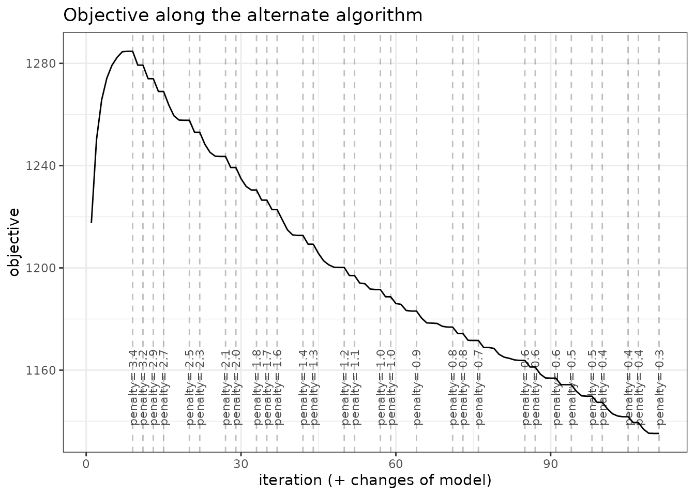
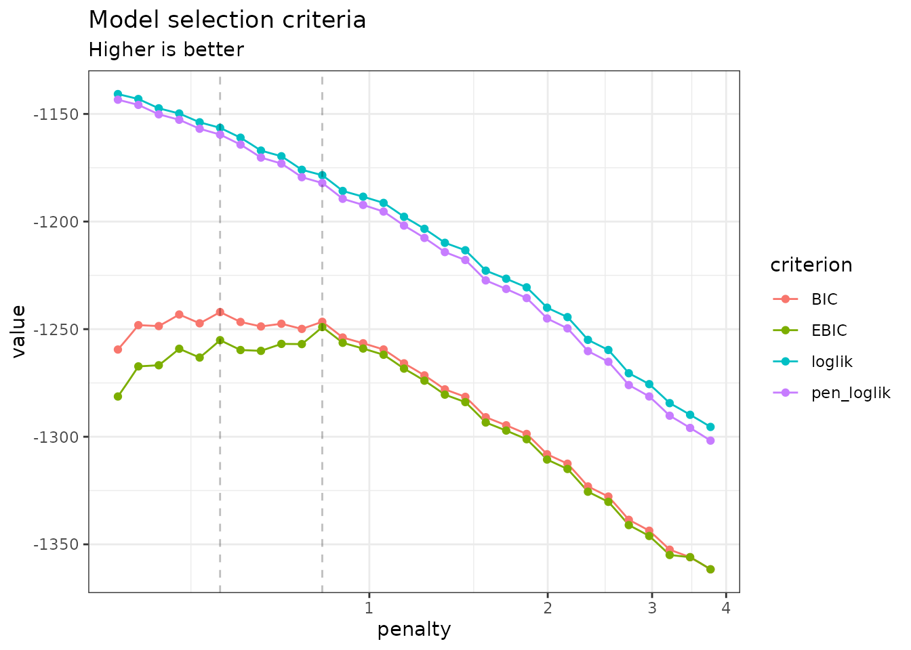
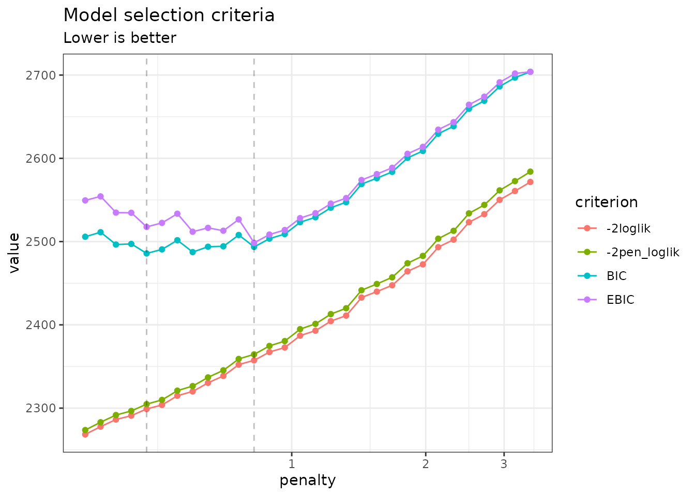
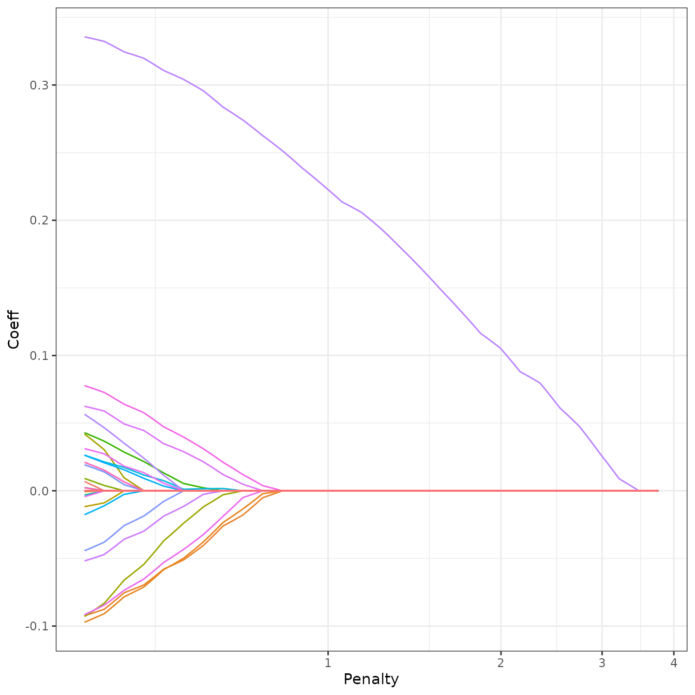
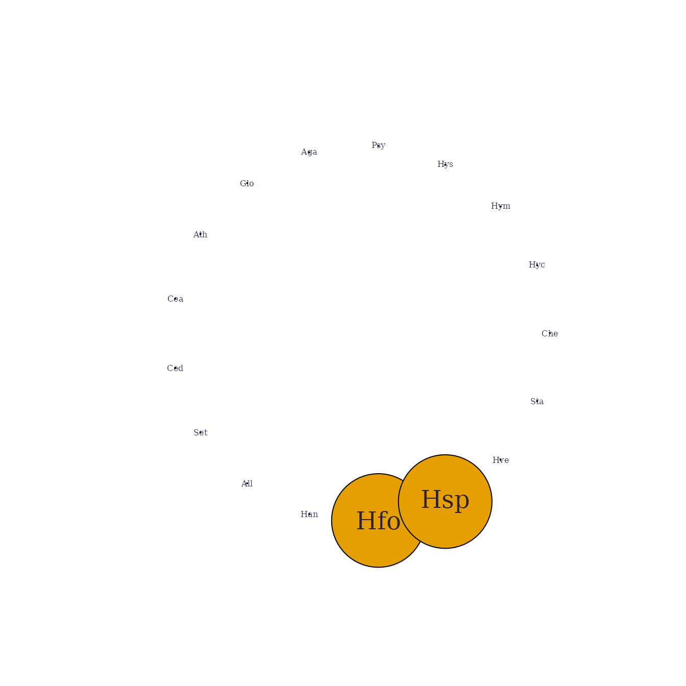
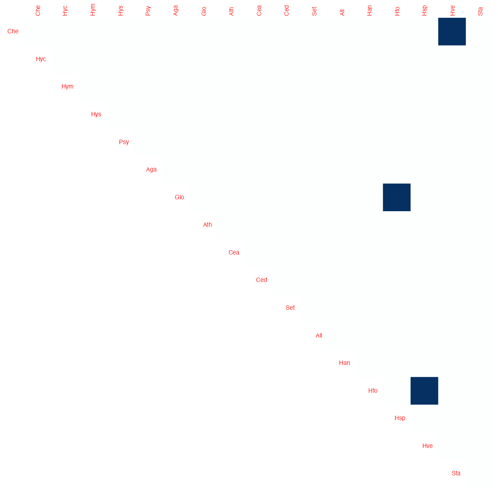

# Sparse structure estimation for multivariate count data with PLN-network

## Preliminaries

This vignette illustrates the standard use of the `PLNnetwork` function
and the methods accompanying the R6 Classes `PLNnetworkfamily` and
`PLNnetworkfit`.

### Requirements

The packages required for the analysis are **PLNmodels** plus some
others for data manipulation and representation:

``` r

library(PLNmodels)
library(ggplot2)
```

### Data set

We illustrate our point with the trichoptera data set, a full
description of which can be found in [the corresponding
vignette](https://pln-team.github.io/PLNmodels/articles/Trichoptera.md).
Data preparation is also detailed in [the specific
vignette](https://pln-team.github.io/PLNmodels/articles/Import_data.md).

``` r

data(trichoptera)
trichoptera <- prepare_data(trichoptera$Abundance, trichoptera$Covariate)
```

The `trichoptera` data frame stores a matrix of counts
(`trichoptera$Abundance`), a matrix of offsets (`trichoptera$Offset`)
and some vectors of covariates (`trichoptera$Wind`,
`trichoptera$Temperature`, etc.)

### Mathematical background

The network model for multivariate count data that we introduce in
Chiquet et al. ([2019](#ref-PLNnetwork)) is a variant of the Poisson
Lognormal model of Aitchison and Ho ([1989](#ref-AiH89)), see [the PLN
vignette](https://pln-team.github.io/PLNmodels/articles/PLN.md) as a
reminder. Compare to the standard PLN model we add a sparsity constraint
on the inverse covariance matrix
$`{\boldsymbol\Sigma}^{-1}\triangleq \boldsymbol\Omega`$ by means of the
$`\ell_1`$-norm, such that $`\|\boldsymbol\Omega\|_1 < c`$. PLN-network
is the equivalent of the sparse multivariate Gaussian model ([Banerjee
et al. 2008](#ref-banerjee2008)) in the PLN framework. It relates some
$`p`$-dimensional observation vectors $`\mathbf{Y}_i`$ to some
$`p`$-dimensional vectors of Gaussian latent variables $`\mathbf{Z}_i`$
as follows
``` math
\begin{equation}
  \begin{array}{rcl}
  \text{latent space } &   \mathbf{Z}_i \sim \mathcal{N}\left({\boldsymbol\mu},\boldsymbol\Omega^{-1}\right) &  \|\boldsymbol\Omega\|_1 < c \\
  \text{observation space } &  Y_{ij} | Z_{ij} \quad \text{indep.} & Y_{ij} | Z_{ij} \sim \mathcal{P}\left(\exp\{Z_{ij}\}\right)
  \end{array}
\end{equation}
```

The parameter $`{\boldsymbol\mu}`$ corresponds to the main effects and
the latent covariance matrix $`\boldsymbol\Sigma`$ describes the
underlying structure of dependence between the $`p`$ variables.

The $`\ell_1`$-penalty on $`\boldsymbol\Omega`$ induces sparsity and
selection of important direct relationships between entities. Hence, the
support of $`\boldsymbol\Omega`$ correspond to a network of underlying
interactions. The sparsity level ($`c`$ in the above mathematical
model), which corresponds to the number of edges in the network, is
controlled by a penalty parameter in the optimization process sometimes
referred to as $`\lambda`$. All mathematical details can be found in
Chiquet et al. ([2019](#ref-PLNnetwork)).

#### Covariates and offsets

Just like PLN, PLN-network generalizes to a formulation close to a
multivariate generalized linear model where the main effect is due to a
linear combination of $`d`$ covariates $`\mathbf{x}_i`$ and to a vector
$`\mathbf{o}_i`$ of $`p`$ offsets in sample $`i`$. The latent layer then
reads
``` math
\begin{equation}
  \mathbf{Z}_i \sim \mathcal{N}\left({\mathbf{o}_i + \mathbf{x}_i^\top\mathbf{B}},\boldsymbol\Omega^{-1}\right), \qquad \|\boldsymbol\Omega\|_1 < c ,
\end{equation}
```
where $`\mathbf{B}`$ is a $`d\times p`$ matrix of regression parameters.

#### Alternating optimization

Regularization via sparsification of $`\boldsymbol\Omega`$ and
visualization of the consecutive network is the main objective in
PLN-network. To reach this goal, we need to first estimate the model
parameters. Inference in PLN-network focuses on the regression
parameters $`\mathbf{B}`$ and the inverse covariance
$`\boldsymbol\Omega`$. Technically speaking, we adopt a variational
strategy to approximate the $`\ell_1`$-penalized log-likelihood function
and optimize the consecutive sparse variational surrogate with an
optimization scheme that alternates between two step

1.  a gradient-ascent-step, performed with the CCSA algorithm of
    Svanberg ([2002](#ref-Svan02)) implemented in the C++ library
    ([Johnson 2011](#ref-nlopt)), which we link to the package.
2.  a penalized log-likelihood step, performed with the graphical-Lasso
    of Friedman et al. ([2008](#ref-FHT08)), implemented in the package
    **fastglasso** ([Sustik and Calderhead 2012](#ref-glassofast)).

More technical details can be found in Chiquet et al.
([2019](#ref-PLNnetwork))

## Analysis of trichoptera data with a PLNnetwork model

In the package, the sparse PLN-network model is adjusted with the
function `PLNnetwork`, which we review in this section. This function
adjusts the model for a series of value of the penalty parameter
controlling the number of edges in the network. It then provides a
collection of objects with class `PLNnetworkfit`, corresponding to
networks with different levels of density, all stored in an object with
class `PLNnetworkfamily`.

### Adjusting a collection of network - a.k.a. a regularization path

`PLNnetwork` finds an hopefully appropriate set of penalties on its own.
This set can be controlled by the user, but use it with care and check
details in
[`?PLNnetwork`](https://pln-team.github.io/PLNmodels/reference/PLNnetwork.md).
The collection of models is fitted as follows:

``` r

network_models <- PLNnetwork(Abundance ~ 1 + offset(log(Offset)), data = trichoptera)
```

    ## 
    ##  Initialization...
    ##  Adjusting 30 PLN with sparse inverse covariance estimation
    ##  Joint optimization alternating gradient descent and graphical-lasso
    ##  sparsifying penalty = 2.123258  sparsifying penalty = 1.961192  sparsifying penalty = 1.811496  sparsifying penalty = 1.673226  sparsifying penalty = 1.54551   sparsifying penalty = 1.427542  sparsifying penalty = 1.318579  sparsifying penalty = 1.217933  sparsifying penalty = 1.124969  sparsifying penalty = 1.039101  sparsifying penalty = 0.9597877     sparsifying penalty = 0.886528  sparsifying penalty = 0.81886   sparsifying penalty = 0.7563572     sparsifying penalty = 0.6986251     sparsifying penalty = 0.6452996     sparsifying penalty = 0.5960444     sparsifying penalty = 0.5505489     sparsifying penalty = 0.508526  sparsifying penalty = 0.4697106     sparsifying penalty = 0.433858  sparsifying penalty = 0.400742  sparsifying penalty = 0.3701537     sparsifying penalty = 0.3419002     sparsifying penalty = 0.3158032     sparsifying penalty = 0.2916982     sparsifying penalty = 0.2694332     sparsifying penalty = 0.2488676     sparsifying penalty = 0.2298717     sparsifying penalty = 0.2123258 
    ##  Post-treatments
    ##  DONE!

Note the use of the `formula` object to specify the model, similar to
the one used in the function `PLN`.

### Structure of `PLNnetworkfamily`

The `network_models` variable is an `R6` object with class
`PLNnetworkfamily`, which comes with a couple of methods. The most basic
is the `show/print` method, which sends a very basic summary of the
estimation process:

``` r

network_models
```

    ## --------------------------------------------------------
    ## COLLECTION OF 30 POISSON LOGNORMAL MODELS
    ## --------------------------------------------------------
    ##  Task: Network Inference 
    ## ========================================================
    ##  - 30 penalties considered: from 0.2123258 to 2.123258 
    ##  - Best model (greater BIC): lambda = 0.47 
    ##  - Best model (greater EBIC): lambda = 0.756

One can also easily access the successive values of the criteria in the
collection

``` r

network_models$criteria %>% head() %>% knitr::kable()
```

| param | nb_param | loglik | BIC | AIC | ICL | n_edges | EBIC | pen_loglik | density | stability |
|---:|---:|---:|---:|---:|---:|---:|---:|---:|---:|:---|
| 2.123258 | 35 | -1240.599 | -1308.706 | -1275.599 | -2719.514 | 1 | -1311.162 | -1245.892 | 0.0069204 | NA |
| 1.961192 | 35 | -1233.931 | -1302.038 | -1268.931 | -2704.993 | 1 | -1304.494 | -1239.082 | 0.0069204 | NA |
| 1.811495 | 35 | -1227.261 | -1295.368 | -1262.261 | -2689.054 | 1 | -1297.824 | -1232.280 | 0.0069204 | NA |
| 1.673226 | 35 | -1220.836 | -1288.943 | -1255.836 | -2673.301 | 1 | -1291.399 | -1225.724 | 0.0069204 | NA |
| 1.545510 | 35 | -1214.663 | -1282.770 | -1249.663 | -2657.834 | 1 | -1285.227 | -1219.420 | 0.0069204 | NA |
| 1.427542 | 35 | -1208.743 | -1276.850 | -1243.743 | -2642.672 | 1 | -1279.306 | -1213.368 | 0.0069204 | NA |

A diagnostic of the optimization process is available via the
`convergence` field:

``` r

network_models$convergence %>% head() %>% knitr::kable()
```

|       |    param | nb_param | status | backend | objective | iterations | convergence  |
|:------|---------:|:---------|:-------|:--------|:----------|:-----------|:-------------|
| out   | 2.123258 | 35       | 3      | newton  | 1240.599  | 20         | 2.382757e-05 |
| elt   | 1.961192 | 35       | 3      | newton  | 1233.931  | 15         | 8.428628e-06 |
| elt.1 | 1.811495 | 35       | 3      | newton  | 1227.261  | 16         | 9.377476e-06 |
| elt.2 | 1.673226 | 35       | 3      | newton  | 1220.836  | 16         | 9.633539e-06 |
| elt.3 | 1.545510 | 35       | 3      | newton  | 1214.663  | 16         | 9.636082e-06 |
| elt.4 | 1.427542 | 35       | 3      | newton  | 1208.743  | 16         | 9.5936e-06   |

An nicer view of this output comes with the option “diagnostic” in the
`plot` method:

``` r

plot(network_models, "diagnostic")
```



### Exploring the path of networks

By default, the `plot` method of `PLNnetworkfamily` displays evolution
of the criteria mentioned above, and is a good starting point for model
selection:

``` r

plot(network_models)
```



Note that we use the original definition of the BIC/ICL criterion
($`\texttt{loglik} - \frac{1}{2}\texttt{pen}`$), which is on the same
scale as the log-likelihood. A [popular
alternative](https://en.wikipedia.org/wiki/Bayesian_information_criterion)
consists in using $`-2\texttt{loglik} + \texttt{pen}`$ instead. You can
do so by specifying `reverse = TRUE`:

``` r

plot(network_models, reverse = TRUE)
```



In this case, the variational lower bound of the log-likelihood is
hopefully strictly increasing (or rather decreasing if using
`reverse = TRUE`) with a lower level of penalty (meaning more edges in
the network). The same holds true for the penalized counterpart of the
variational surrogate. Generally, smoothness of these criteria is a good
sanity check of optimization process. BIC and its extended-version
high-dimensional version EBIC are classically used for selecting the
correct amount of penalization with sparse estimator like the one used
by PLN-network. However, we will consider later a more robust albeit
more computationally intensive strategy to chose the appropriate number
of edges in the network.

To pursue the analysis, we can represent the coefficient path (i.e.,
value of the edges in the network according to the penalty level) to see
if some edges clearly come off. An alternative and more intuitive view
consists in plotting the values of the partial correlations along the
path, which can be obtained with the options `corr = TRUE`. To this end,
we provide the S3 function `coefficient_path`:

``` r

coefficient_path(network_models, corr = TRUE) %>%
  ggplot(aes(x = Penalty, y = Coeff, group = Edge, colour = Edge)) +
    geom_line(show.legend = FALSE) +  coord_transform(x="log10") + theme_bw()
```



### Model selection issue: choosing a network

To select a network with a specific level of penalty, one uses the
`getModel(lambda)` S3 method. We can also extract the best model
according to the BIC or EBIC with the method
[`getBestModel()`](https://pln-team.github.io/PLNmodels/reference/getBestModel.md).

``` r

model_pen <- getModel(network_models, network_models$penalties[20]) # give some sparsity
model_BIC <- getBestModel(network_models, "BIC")   # if no criteria is specified, the best BIC is used
```

An alternative strategy is to use StARS ([Liu et al. 2010](#ref-stars)),
which performs resampling to evaluate the robustness of the network
along the path of solutions in a similar fashion as the stability
selection approach of Meinshausen and Bühlmann
([2010](#ref-stabilitySelection)), but in a network inference context.

Resampling can be computationally demanding but is easily parallelized:
the function `stability_selection` relies on
[`parallel::mclapply`](https://rdrr.io/r/parallel/mclapply.html) to
perform parallel computing. Set the number of workers with the
`mc.cores` option (forking-based, so only effective on Unix-like
systems; ignored on Windows):

``` r

options(mc.cores = 2)
```

We first invoke `stability_selection` explicitly for pedagogical
purpose. In this case, we need to build our sub-samples manually:

``` r

n <- nrow(trichoptera)
subs <- replicate(10, sample.int(n, size = n/2), simplify = FALSE)
stability_selection(network_models, subsamples = subs)
```

    ## 
    ## Stability Selection for PLNnetwork: 
    ## subsampling: ++++++++++

Requesting ‘StARS’ in `gestBestmodel` automatically invokes
`stability_selection` with 20 sub-samples, if it has not yet been run.

``` r

model_StARS <- getBestModel(network_models, "StARS")
```

When “StARS” is requested for the first time, `getBestModel`
automatically calls the method `stability_selection` with the default
parameters. After the first call, the stability path is available from
the `plot` function:

``` r

plot(network_models, "stability")
```


When you are done, do not forget to get back to the default (sequential)
behavior.

``` r

options(mc.cores = 1)
```

### Structure of a `PLNnetworkfit`

The variables `model_BIC`, `model_StARS` and `model_pen` are other
`R6Class` objects with class `PLNnetworkfit`. They all inherits from the
class `PLNfit` and thus own all its methods, with a couple of specific
one, mostly for network visualization purposes. Most fields and methods
are recalled when such an object is printed:

``` r

model_StARS
```

    ## Poisson Lognormal with sparse inverse covariance (penalty = 1.04)
    ## ==================================================================
    ##  nb_param   loglik       BIC      AIC       ICL n_edges      EBIC pen_loglik
    ##        35 -1187.49 -1255.597 -1222.49 -2585.114       1 -1258.053  -1191.596
    ##  density
    ##    0.007
    ## ==================================================================
    ## * Useful fields
    ##     $model_par, $latent, $latent_pos, $var_par, $optim_par
    ##     $loglik, $BIC, $ICL, $loglik_vec, $nb_param, $criteria
    ## * Useful S3 methods
    ##     print(), coef(), sigma(), vcov(), fitted()
    ##     predict(), predict_cond(), standard_error()
    ## * Additional fields for sparse network
    ##     $EBIC, $density, $penalty 
    ## * Additional S3 methods for network
    ##     plot.PLNnetworkfit()

The `plot` method provides a quick representation of the inferred
network, with various options (either as a matrix, a graph, and always
send back the plotted object invisibly if users needs to perform
additional analyses).

``` r

my_graph <- plot(model_StARS, plot = FALSE)
my_graph
```

    ## IGRAPH 6fb3197 UNW- 17 1 -- 
    ## + attr: name (v/c), label (v/c), label.cex (v/n), size (v/n),
    ## | label.color (v/c), weight (e/n), color (e/c), width (e/n)
    ## + edge from 6fb3197 (vertex names):
    ## [1] Hfo--Hsp

``` r

plot(model_StARS)
```



``` r

plot(model_StARS, type = "support", output = "corrplot")
```



We can finally check that the fitted value of the counts – even with
sparse regularization of the covariance matrix – are close to the
observed ones:

``` r

data.frame(
  fitted   = as.vector(fitted(model_StARS)),
  observed = as.vector(trichoptera$Abundance)
) %>%
  ggplot(aes(x = observed, y = fitted)) +
    geom_point(size = .5, alpha =.25 ) +
    scale_x_log10(limits = c(1,1000)) +
    scale_y_log10(limits = c(1,1000)) +
    theme_bw() + annotation_logticks()
```


fitted value vs. observation

## References

Aitchison, J., and C. H. Ho. 1989. “The Multivariate Poisson-Log Normal
Distribution.” *Biometrika* 76 (4): 643–53.

Banerjee, Onureena, Laurent El Ghaoui, and Alexandre d’Aspremont. 2008.
“Model Selection Through Sparse Maximum Likelihood Estimation for
Multivariate Gaussian or Binary Data.” *Journal of Machine Learning
Research* 9 (Mar): 485–516.

Chiquet, Julien, Stephane Robin, and Mahendra Mariadassou. 2019.
“Variational Inference for Sparse Network Reconstruction from Count
Data.” In *Proceedings of the 36th International Conference on Machine
Learning*, edited by Kamalika Chaudhuri and Ruslan Salakhutdinov, vol.
97. Proceedings of Machine Learning Research. PMLR.
[http://proceedings.mlr.press/v97/chiquet19a.html](http://proceedings.mlr.press/v97/chiquet19a.md).

Friedman, J., T. Hastie, and R. Tibshirani. 2008. “Sparse Inverse
Covariance Estimation with the Graphical Lasso.” *Biostatistics* 9 (3):
432–41.

Johnson, Steven G. 2011. *The NLopt Nonlinear-Optimization Package*.
<https://nlopt.readthedocs.io/en/latest/>.

Liu, Han, Kathryn Roeder, and Larry Wasserman. 2010. “Stability Approach
to Regularization Selection (StARS) for High Dimensional Graphical
Models.” *Proceedings of the 23rd International Conference on Neural
Information Processing Systems - Volume 2* (USA), 1432–40.

Meinshausen, Nicolai, and Peter Bühlmann. 2010. “Stability Selection.”
*Journal of the Royal Statistical Society: Series B (Statistical
Methodology)* 72 (4): 417–73.

Sustik, Mátyás A, and Ben Calderhead. 2012. “GLASSOFAST: An Efficient
GLASSO Implementation.” *UTCS Technical Report TR-12-29 2012*.

Svanberg, Krister. 2002. “A Class of Globally Convergent Optimization
Methods Based on Conservative Convex Separable Approximations.” *SIAM
Journal on Optimization* 12 (2): 555–73.
