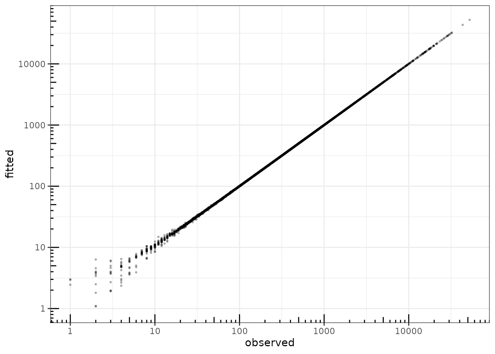

# Zero-inflated PLN models for multivariate count data with excess zeros

## Preliminaries

This vignette illustrates the `ZIPLN` and `ZIPLNnetwork` functions and
the methods accompanying the R6 classes `ZIPLNfit` and
`ZIPLNnetworkfamily`. These models extend `PLN` and `PLNnetwork` (see
the corresponding vignettes) to count data with an excess of zeros that
a (sparse) Poisson lognormal model alone cannot capture.

### Requirements

The packages required for the analysis are **PLNmodels** plus some
others for data manipulation and representation:

``` r

library(PLNmodels)
library(ggplot2)
```

### Data set

We illustrate zero-inflation with the `microcosm` data set ([Mariadassou
et al. 2023](#ref-microcosm)): the evolution of the microbiota of
lactating cows, sampled in 4 body sites (oral, nasal, vaginal, milk) at
several time points, with **p = 259** taxa, **n = 880** samples and an
average of 90% zeroes. To keep this vignette fast to compile while
remaining representative, we restrict the analysis to the **30 most
abundant taxa**, which still display substantial zero-inflation:

``` r

data(microcosm)
most_abundant <- order(colSums(microcosm$Abundance), decreasing = TRUE)[1:30]
microcosm$Abundance <- microcosm$Abundance[, most_abundant]
mean(microcosm$Abundance == 0)
```

    ## [1] 0.8018182

### Mathematical background

The zero-inflated PLN model (ZIPLN) combines the Poisson lognormal model
([Aitchison and Ho 1989](#ref-AiH89)) – see [the PLN
vignette](https://pln-team.github.io/PLNmodels/articles/PLN.md) – with a
zero-inflation mechanism: each count $`Y_{ij}`$ is either a structural
zero (with probability $`\pi_{ij}`$) or drawn from the usual PLN
generative process:
``` math
\begin{equation}
  \begin{array}{rcl}
  \text{latent space } &   \mathbf{Z}_i \sim \mathcal{N}\left({\boldsymbol\mu},\boldsymbol\Sigma\right) & \\
  \text{zero-inflation } &  W_{ij} \sim \mathcal{B}(\pi_{ij}) & \text{independent of } \mathbf{Z}_i\\
  \text{observation space } &  Y_{ij} \,|\, Z_{ij}, W_{ij} = 0 \sim \mathcal{P}\left(\exp\{Z_{ij}\}\right), &  Y_{ij} \,|\, W_{ij} = 1 \;=\; 0
  \end{array}
\end{equation}
```

Just like PLN, $`{\boldsymbol\mu}`$ generalizes to
$`\mathbf{o}_i + \mathbf{x}_i^\top\mathbf{B}`$ to account for offsets
and covariates. The zero-inflation probabilities $`\pi_{ij}`$ can be
parameterized in several ways, controlled by the `zi` argument of
[`ZIPLN()`](https://pln-team.github.io/PLNmodels/reference/ZIPLN.md):

- `"single"`: a single $`\pi`$ shared by all entries (default).
- `"row"`: one $`\pi_i`$ per sample.
- `"col"`: one $`\pi_j`$ per species.
- covariates:
  $`\text{logit}(\pi_{ij}) = \mathbf{x}_{0,i}^\top\mathbf{B}_{0,j}`$,
  specified with the formula syntax `Y ~ PLN effect | ZI effect` (see
  below).

`ZIPLNnetwork` further adds a sparsity penalty on
$`\boldsymbol\Omega = \boldsymbol\Sigma^{-1}`$, exactly as `PLNnetwork`
does for PLN (see [the PLNnetwork
vignette](https://pln-team.github.io/PLNmodels/articles/PLNnetwork.md)
and Chiquet et al. ([2019](#ref-PLNnetwork))), so that both the excess
of zeros and the residual dependency structure between taxa are
accounted for.

## Analysis of microcosm with ZIPLN

### Comparing zero-inflation parameterizations

We fit a plain `PLN` model and the four `ZIPLN` parameterizations, all
with the sampling site as a covariate for the count part, to check how
much accounting for zero-inflation improves the fit:

``` r

myPLN     <- PLN(Abundance ~ 0 + site + offset(log(Offset)), data = microcosm)
zi_single <- ZIPLN(Abundance ~ 0 + site + offset(log(Offset)), data = microcosm)
zi_row    <- ZIPLN(Abundance ~ 0 + site + offset(log(Offset)), data = microcosm, zi = "row")
zi_col    <- ZIPLN(Abundance ~ 0 + site + offset(log(Offset)), data = microcosm, zi = "col")
zi_site   <- ZIPLN(Abundance ~ 0 + site + offset(log(Offset)) | 0 + site, data = microcosm)
```

``` r

data.frame(
  model  = c("PLN", "ZIPLN (single)", "ZIPLN (row)", "ZIPLN (col)", "ZIPLN (site-dependent)"),
  loglik = c(myPLN$loglik, zi_single$loglik, zi_row$loglik, zi_col$loglik, zi_site$loglik),
  BIC    = c(myPLN$BIC, zi_single$BIC, zi_row$BIC, zi_col$BIC, zi_site$BIC),
  ICL    = c(myPLN$ICL, zi_single$ICL, zi_row$ICL, zi_col$ICL, zi_site$ICL)
) %>% knitr::kable(digits = 1)
```

| model                  |   loglik |      BIC |       ICL |
|:-----------------------|---------:|---------:|----------:|
| PLN                    | -51716.2 | -53699.3 | -100954.0 |
| ZIPLN (single)         | -48847.5 | -50834.0 |  -89988.5 |
| ZIPLN (row)            | -46875.9 | -51842.2 |  -89899.3 |
| ZIPLN (col)            | -48147.4 | -50232.3 |  -87715.3 |
| ZIPLN (site-dependent) | -47647.5 | -50037.4 |  -85962.4 |

Accounting for zero-inflation brings a large improvement over plain
`PLN`, and letting the zero-inflation probability depend on the body
site (`zi_site`) gives the best BIC and ICL among the parameterizations
considered – not surprising given how different the four body sites are.

### Inspecting the fit

As for `PLN`, fitted values stay close to the observed counts:

``` r

data.frame(
  fitted   = as.vector(fitted(zi_site)),
  observed = as.vector(microcosm$Abundance)
) %>%
  ggplot(aes(x = observed, y = fitted)) +
    geom_point(size = .5, alpha = .25) +
    scale_x_log10(limits = c(1, NA)) +
    scale_y_log10(limits = c(1, NA)) +
    theme_bw() + ggplot2::annotation_logticks()
```



fitted value vs. observation

The site-dependent model also lets us recover, for each species, an
estimated zero-inflation probability per body site (`model_par$Pi`),
revealing substantial heterogeneity:

``` r

one_obs_per_site <- !duplicated(microcosm$site)
pi_hat <- zi_site$model_par$Pi[one_obs_per_site, ]
rownames(pi_hat) <- as.character(microcosm$site[one_obs_per_site])

data.frame(site = rep(rownames(pi_hat), ncol(pi_hat)), zi_prob = as.vector(pi_hat)) %>%
  ggplot(aes(x = site, y = zi_prob)) +
    geom_boxplot() + theme_bw() +
    labs(x = "Body site", y = "Zero-inflation probability (per species)")
```


Estimated zero-inflation probability by body site, across the 30 species

Coefficient matrices for the count and zero-inflation parts can be
inspected with [`coefficients()`](https://rdrr.io/r/stats/coef.html) –
here both components share the same `site` design, so rows of
$`\mathbf{B}`$ (count) and $`\mathbf{B}_0`$ (zero-inflation) line up
one-to-one with body sites:

``` r

pheatmap::pheatmap(coefficients(zi_site, "zero"), cluster_rows = FALSE)
```


Estimated regression coefficients of the zero-inflation component
($`B_0`$)

``` r

pheatmap::pheatmap(coefficients(zi_site, "count"), cluster_rows = FALSE)
```


Estimated regression coefficients of the count component ($`B`$)

## Sparse network inference with ZIPLNnetwork

`ZIPLNnetwork` adjusts the model for a series of penalties controlling
the number of edges in the network, just like `PLNnetwork`, but on top
of a zero-inflation component. We keep the default `zi = "single"` here
for simplicity and focus on the network. The default
`backend = "builtin"` is used (it now finds a consistently better ELBO
than `"nlopt"` here, at the cost of being slower); we lower `min_ratio`
to explore a wider, sparser range of the penalty path:

``` r

zi_models <- ZIPLNnetwork(Abundance ~ site + offset(log(Offset)), data = microcosm, control = ZIPLNnetwork_param(min_ratio = 0.01))
```

As for `PLNnetwork`, a diagnostic plot and the evolution of the criteria
along the path are available:

``` r

plot(zi_models, "diagnostic")
```


diagnostic of the ZIPLNnetwork fits

``` r

plot(zi_models)
```


evolution of model selection criteria

We select a network with
[`getBestModel()`](https://pln-team.github.io/PLNmodels/reference/getBestModel.md)
and represent it:

``` r

zi_net <- getBestModel(zi_models, "EBIC")
plot(zi_net)
```


sparse residual network between the 30 most abundant taxa

As for `PLNnetwork`, a more robust (but more computationally intensive)
[`stability_selection()`](https://pln-team.github.io/PLNmodels/reference/stability_selection.md)-based
choice of penalty is available – we do not run it here to keep this
vignette fast, see [the PLNnetwork
vignette](https://pln-team.github.io/PLNmodels/articles/PLNnetwork.md)
for an example.

## References

Aitchison, J., and C. H. Ho. 1989. “The Multivariate Poisson-Log Normal
Distribution.” *Biometrika* 76 (4): 643–53.

Chiquet, Julien, Stephane Robin, and Mahendra Mariadassou. 2019.
“Variational Inference for Sparse Network Reconstruction from Count
Data.” In *Proceedings of the 36th International Conference on Machine
Learning*, edited by Kamalika Chaudhuri and Ruslan Salakhutdinov, vol.
97. Proceedings of Machine Learning Research. PMLR.
[http://proceedings.mlr.press/v97/chiquet19a.html](http://proceedings.mlr.press/v97/chiquet19a.md).

Mariadassou, Mahendra, Lucie X Nouvel, Fabienne Constant, et al. 2023.
“Microbiota Members from Body Sites of Dairy Cows Are Largely Shared
Within Individual Hosts Throughout Lactation but Sharing Is Limited in
the Herd.” *Animal Microbiome* 5 (32).
<https://doi.org/10.1186/s42523-023-00252-w>.
