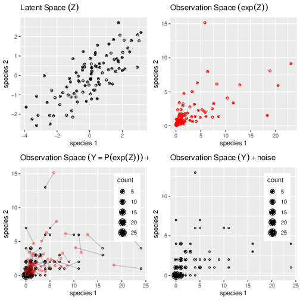

```{r setup, include=FALSE}
knitr::opts_chunk$set(
  screenshot.force = FALSE, 
  echo = TRUE,
  rows.print = 5,
  message = FALSE, 
  warning = FALSE)
```

## Preliminaries

This vignette illustrates the use of the `PLN` function and the methods accompanying the R6 class `PLNfit`. 

From the statistical point of view, the function `PLN` adjusts a multivariate Poisson lognormal model to a table of counts, possibly after correcting for effects of offsets and covariates. `PLN` is the building block for all the multivariate models found in the `PLNmodels` package: having a basic understanding of both the mathematical background and the associated set of `R` functions is a good place to start. 

### Requirements

The packages required for the analysis are **PLNmodels** plus some others for data manipulation and representation:

```{r requirement}
library(PLNmodels)
library(ggplot2)
library(corrplot)
```

### Data set

We illustrate our point with the trichoptera data set, a full description of which can be found in [the corresponding vignette](Trichoptera.html). Data preparation is also detailed in [the specific vignette](Import_data.html).

```{r data_load}
data(trichoptera)
trichoptera <- prepare_data(trichoptera$Abundance, trichoptera$Covariate)
```

The `trichoptera` data frame stores a matrix of counts (`trichoptera$Abundance`), a matrix of offsets (`trichoptera$Offset`) and some vectors of covariates (`trichoptera$Wind`, `trichoptera$Temperature`, etc.)

### Mathematical background

The multivariate Poisson lognormal model (in short PLN, see @AiH89) relates some $p$-dimensional observation vectors $\mathbf{Y}_i$ to some  $p$-dimensional vectors of Gaussian latent variables $\mathbf{Z}_i$ as follows

\begin{equation}
  \begin{array}{rcl}
  \text{latent space } &   \mathbf{Z}_i \sim \mathcal{N}({\boldsymbol\mu},\boldsymbol\Sigma), \\
  \text{observation space } &  Y_{ij} | Z_{ij} \quad \text{indep.} &   \mathbf{Y}_i | \mathbf{Z}_i\sim\mathcal{P}\left(\exp\{\mathbf{Z}_i\}\right).
  \end{array}
\end{equation}

The parameter ${\boldsymbol\mu}$ corresponds to the main effects and the latent covariance matrix $\boldsymbol\Sigma$ describes the underlying residual structure of dependence between the $p$ variables.  The following figure provides insights about the role played by the different layers

<!-- ```{r geometricalInsight, echo = FALSE, fig.cap = "PLN: geometrical view", fig.width=7, fig.height=7, fig.align='center'} -->
<!--  -->
<!-- ``` -->

```{r geometricalInsight, echo = FALSE, message = FALSE, warning = FALSE, fig.cap = "PLN: geometrical view", fig.width=7, fig.height=7, fig.align='center'}

library(grid)
library(gridExtra)
library(dplyr)

set.seed(20171110)
x <- rnorm(100)
y <- rnorm(100)
b <- data.frame(x = x + y, y = y) / 1
mu <- 0
##
data.perfect <- as.data.frame((b + matrix(rep(mu, each = length(x)), ncol = 2)))
p.latent <- ggplot(data.perfect, aes(x, y)) + geom_point() + ggtitle(expression(Latent~Space~(Z)))
.rpois <- function(lambda) {
  unlist(lapply(exp(lambda), function(x) {rpois(1, x)}))
}
observation <- as.data.frame(lapply(data.perfect, .rpois))
mapped.parameter <- as.data.frame(lapply(data.perfect, exp))
## segment between mapped and observed data
segment.data <- cbind(mapped.parameter, observation)
names(segment.data) <- c("x", "y", "xend", "yend")
## Mapped parameters
p.mapped <- ggplot(mapped.parameter, aes(x, y)) + geom_point(col = "red") + ggtitle(expression(Observation~Space~(exp(Z))))
## Observations only
obs <- group_by(observation, x, y)
obs <- dplyr::summarize(obs, count = n())
p.observation.only <- ggplot(obs, aes(x, y)) +
  geom_point(aes(size = count)) +
  ggtitle(Observation~Space~(Y)~+'noise') +
  theme(legend.position = c(.95, .95), legend.justification = c(1, 1),
        legend.background = element_rect(color = "transparent"),
        legend.box.background = element_blank())
## Observations and latent parameters
p.observation.mixed <- p.observation.only +
  geom_point(data = mapped.parameter, color = "red", alpha = 0.5) +
  geom_segment(data = segment.data, aes(xend = xend, yend = yend), color = "black", alpha = 0.2) +
  ggtitle(Observation~Space~(Y==P(exp(Z)))~+'noise')

grid.arrange(p.latent + labs(x = "species 1", y = "species 2"),
             p.mapped  + labs(x = "species 1", y = "species 2"),
             p.observation.mixed + labs(x = "species 1", y = "species 2"),
             p.observation.only + labs(x = "species 1", y = "species 2"),
             ncol = 2)
```

#### Covariates and offsets

This model generalizes naturally to a formulation closer to a multivariate generalized linear model, where the main effect is due to a linear combination of $d$ covariates $\mathbf{x}_i$ (including a vector of intercepts). We also let the possibility to add some offsets for the $p$ variables in in each sample, that is $\mathbf{o}_i$. Hence, the previous model generalizes to

\begin{equation}
  \mathbf{Y}_i | \mathbf{Z}_i \sim \mathcal{P}\left(\exp\{\mathbf{Z}_i\}\right), \qquad \mathbf{Z}_i \sim \mathcal{N}({\mathbf{o}_i + \mathbf{x}_i^\top\boldsymbol\Theta},\boldsymbol\Sigma), \\
\end{equation}
where $\boldsymbol\Theta$ is a $d\times p$ matrix of regression parameters. When all individuals $i=1,\dots,n$ are stacked together, the data matrices available to feed the model are

  - the $n\times p$ matrix of counts  $\mathbf{Y}$
  - the $n\times d$ matrix of design  $\mathbf{X}$
  - the $n\times p$ matrix of offsets $\mathbf{O}$

Inference in PLN then focuses on the regression parameters $\boldsymbol\Theta$ and on the covariance matrix $\boldsymbol\Sigma$. 

#### Optimization by Variational inference

Technically speaking, we adopt in  **PLNmodels** a variational strategy to approximate the log-likelihood function and optimize the consecutive variational surrogate of the log-likelihood with a gradient-ascent-based approach. To this end, we rely on the CCSA algorithm of @Svan02 implemented in the C++ library [@nlopt], which we link to the package.

## Analysis of trichoptera data with a PLN model

The standard PLN model described above is adjusted with the function `PLN`. We now review its usage on a the trichoptera data set.

### A PLN model with latent main effects

#### Adjusting a fit

In order to become familiar with the function `PLN` and its outputs, let us first fit a simple PLN model with just an intercept for each species: 

```{r simple PLN}
myPLN <- PLN(Abundance ~ 1, trichoptera)
```

Note the use of the `formula` object to specify the model: the vector $\boldsymbol\mu$ of main effects in the mathematical formulation (one per column species) is specified in the call with the term `~ 1` in the right-hand-side of the formula. `Abundance` is a variable in the data frame `trichoptera` corresponding to a matrix of 17 columns and the _response_ in the model, occurring on the left-hand-side of the formula.

#### The `PLNfit` object 

`myPLN` is an `R6` object with class `PLNfit`, which comes with a couple of methods, as recalled when printing/showing such an object in the `R` console:

```{r show-method}
myPLN
```

See also `?PLNfit` for more comprehensive information.

#### Field access

Accessing public fields of a `PLNfit` object can be done just like with a traditional list, _e.g._,

```{r fields-access}
c(myPLN$loglik, myPLN$BIC, myPLN$ICL, myPLN$R_squared)
myPLN$criteria
```

#### GLM-like interface

We provide a set of S3-methods for `PLNfit` that mimic the standard (G)LM-like interface of `R::stats`, which we present now.

One can access the fitted value of the counts (`Abundance` -- $\hat{\mathbf{Y}}$) and check that the algorithm basically learned correctly from the data^[We use a log-log scale in our plot in order not to give an excessive importance to the higher counts in the fit]:

```{r fitted, fig.cap = "fitted value vs. observation", fig.dim=c(7,5)}
data.frame(
  fitted   = as.vector(fitted(myPLN)),
  observed = as.vector(trichoptera$Abundance)
) %>% 
  ggplot(aes(x = observed, y = fitted)) + 
    geom_point(size = .5, alpha =.25 ) + 
    scale_x_log10() + 
    scale_y_log10() + 
    theme_bw() + annotation_logticks()
```

We can also reach the matrix of regression parameters $\mathbf{\Theta}$ and the residual variance/covariance matrix $\boldsymbol{\Sigma}$ of the latent variable with the traditional functions found in `R` for (G)LM manipulation: for the regression coefficients, we can use the `coef` (or `coefficients`) method. Approximated standard errors of the coefficients are also accessible via `standard_error`:

```{r coef}
data.frame(
  rbind(t(coef(myPLN)), t(standard_error(myPLN))), 
  row.names = c("effect", "stderr")
 ) %>% select(1:5) %>% knitr::kable()
```

<!-- rmarkdown::paged_table() causes re-building of vignette to fail on CRAN for OS X and Solaris flavor (probably due to a too old version of pandoc) -->


The residual covariance matrix better displays as an image matrix: 

```{r plot covariance, fig.width=7, fig.height=5}
corrplot(sigma(myPLN), is.corr = FALSE)
```

#### Observation weights

It is also possible to use observation weights like in standard (G)LMs:

```{r weighted, fig.width=7, fig.height=5}
myPLN_weighted <-
  PLN(
    Abundance ~ 1,
    data    = trichoptera,
    weights = runif(nrow(trichoptera)),
    control = list(trace = 0)
  )
data.frame(
  unweighted = as.vector(fitted(myPLN)),
  weighted   = as.vector(fitted(myPLN_weighted))
) %>%
  ggplot(aes(x = unweighted, y = weighted)) +
    geom_point(size = .5, alpha =.25 ) +
    scale_x_log10() +
    scale_y_log10() +
    theme_bw() + annotation_logticks()
```

<!-- #### Optimization diagnostic -->

<!-- Results of the optimization process can be monitored via the `$optim_par` field:  -->

<!-- ```{r optim_par} -->
<!-- myPLN$optim_par -->
<!-- ``` -->

<!-- #### Make prediction with new data -->

<!-- The prediction method can be use to predict new responses from a new table of data (with both covariates and offset if needed.) -->

<!-- ```{r prediction} -->
<!-- newdata <- trichoptera[1:10, ] -->
<!-- newdata$Abundance <- NULL -->
<!-- predict(myPLN, newdata = newdata, type = "response") -->
<!-- ``` -->

### Accounting for covariates and offsets

For ecological count data, it is generally a good advice to include the sampling effort via an offset term whenever available, otherwise samples are not necessarily comparable:

```{r PLN offset}
myPLN_offsets <- 
  PLN(Abundance ~ 1 + offset(log(Offset)), 
      data = trichoptera, control = list(trace = 0))
```

Note that we use the function `offset` with a log-transform of the total counts since it acts in the latent layer of the model. Obviously the model with offsets is better since the log-likelihood is higher with the same number of parameters^[In **PLNmodels** the R-squared is a pseudo-R-squared that can only be trusted between model where the same offsets term was used]:

```{r compare w/wo offset}
rbind(
  myPLN$criteria,
  myPLN_offsets$criteria
) %>% knitr::kable()
```

Let us try to correct for the wind effect in our model:
```{r PLN wind}
myPLN_wind <- PLN(Abundance ~ 1 + Wind + offset(log(Offset)), data = trichoptera)
```

When we compare the models, the gain is clear in terms of log-likelihood. However, the BIC chooses not to include this variable:

```{r compare models}
rbind(
  myPLN_offsets$criteria,
  myPLN_wind$criteria
) %>% knitr::kable()
```

### Covariance models (full, diagonal, spherical)

It is possible to change a bit the parametrization used for modeling the residual covariance matrix $\boldsymbol\Sigma$, and thus reduce the total number of parameters used in the model. By default, the residual covariance is fully parameterized (hence $p \times (p+1)/2$ parameters). However, we can chose to only model the variances of the species and not the covariances, by means of a diagonal matrix $\boldsymbol\Sigma_D$ with only $p$ parameters. In an extreme situation, we may also chose a single variance parameter for the whole matrix $\boldsymbol\Sigma = \sigma \mathbf{I}_p$. This can be tuned in `PLN` with the `control` argument, a list controlling various aspects of the underlying optimization process:

```{r covariances models spherical}
myPLN_spherical <-
  PLN(
    Abundance ~ 1 + offset(log(Offset)),
    data = trichoptera, control = list(covariance = "spherical", trace = 0)
  )
```


```{r covariances model diagonal}
myPLN_diagonal <-
  PLN(
    Abundance ~ 1 + offset(log(Offset)),
    data = trichoptera, control = list(covariance = "diagonal", trace = 0)
  )
```

Note that, by default, the model chosen is `covariance = "spherical"`, so that the two following calls are equivalents:
```{r PLN covariance full, evaluate = FALSE}
myPLN_default <-
  PLN(Abundance ~ 1, data = trichoptera, )
myPLN_full <-
  PLN(Abundance ~ 1, data = trichoptera, control = list(covariance = "full"))
```

Different covariance models can then be compared with the usual criteria: it seems that the gain brought by passing from a diagonal matrix to a fully parameterized covariance is not worth having so many additional parameters:

```{r compare covariances}
rbind(
  myPLN_offsets$criteria,
  myPLN_diagonal$criteria,
  myPLN_spherical$criteria
) %>%
  as.data.frame(row.names = c("full", "diagonal", "spherical")) %>%
  knitr::kable()
```

A final model that we can try is the diagonal one with the wind as a covariate, which gives a slight improvement.

```{r final}
myPLN_final <-
  PLN(
    Abundance ~ 1 + Wind + offset(log(Offset)),
    data    = trichoptera, control = list(covariance = "diagonal", trace = 0)
  )
rbind(
  myPLN_wind$criteria,
  myPLN_diagonal$criteria,
  myPLN_final$criteria
) %>% knitr::kable()
```

## References
